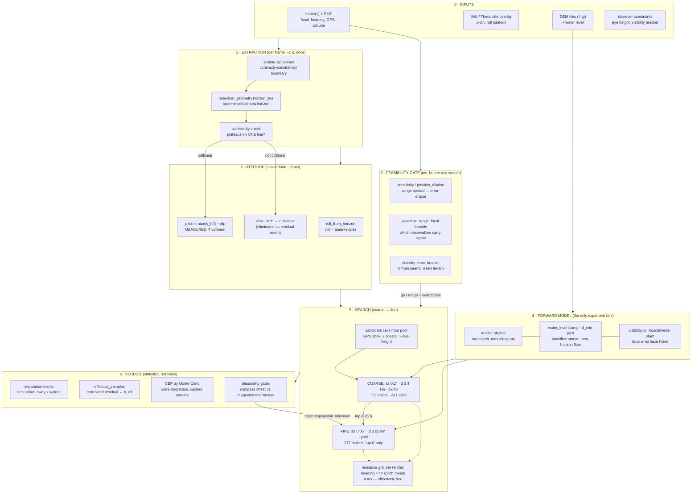

# Terrain-fix architecture

The design target is set by one measurement: **the render is 98.6% of the cost**
(273 ms/candidate against 4 ms to score), and a coarse render that is 35× cheaper
still ranks the true winner #3 of 1492. So the architecture is arranged around a
single principle — **render as rarely, as coarsely, and as late as possible** —
and everything else (attitude, nuisance parameters, verdicts) is organised to be
computable *without* touching the DEM.

## The six layers

### 0 · Inputs, ranked by trust

GPS is a **rough prior only** — it centres the search box, never scores a
candidate. EXIF focal length is trusted (the 13 vs 14 mm episode: three searches
railed their focal grids before the EXIF settled it). EXIF heading is a prior
with slack bounded by *measured* magnetometer behaviour, not by hope. Stated
attitude (Theodolite) is a cross-check, not an input — the sea horizon outranks
it when the two disagree.

### 1 · Extraction — once per frame, never per candidate

`skyline_dp` traces the boundary as a min-cost path (continuity beats per-column
strength). `horizon_line` fits the sea horizon as the **lower envelope**, and the
**collinearity check is the gate**: a horizon is a plane through the camera
centre, so its flat stretches must sit on one straight line. 000039 passed
(three plateaus within 3 px of one line) and got a measured pitch; IMG_7846
failed (rows 2422/2394/2391) and pitch stayed a nuisance. This one bit decides
the dimensionality of the whole search.

### 2 · Attitude — closed form, zero DEM cost

Roll from the horizon slope (`atan(+slope)` — the sign is written in exactly one
place because the wrong sign masquerades as barrel distortion). Pitch from the
horizon row and the dip, stable to ±0.02° across eye-height uncertainty because
dip goes as √h. When the gate fails, pitch enters linearly and is eliminated per
hypothesis as the residual mean — never gridded.

### 3 · Feasibility gate — milliseconds, before any search

`resection_geometry` answers *will this view fix a position at all*: range
spread → absorbed sensitivities → error ellipse; the blind-range test for
waterlines; `visibility_from_bracket` reads the day's visual range off what the
photo does and does not show (Büyükada seen, Samanlı absent → V ∈ [6, 30] km).
Two real datasets were searched exhaustively before this layer existed; both
answers were computable in milliseconds.

### 4 · Forward model — the only box allowed to be slow

One function, four documented traps, all the same mistake in different clothing
(*the render answering a question the photograph didn't ask*):

| trap | fix | cost of ignoring |
|---|---|---|
| bathymetry in the tiles | `water_level_m` clamp | horizon on the sea floor |
| SRTM coastline smear | `d_min_km` past it | phantom +0.65° floor |
| truncated march on open water | sea-horizon clamp at −dip | −10′ bias (short renders) |
| geometric ≠ atmospheric visibility | Koschmieder slant path | 50′ errors, 32.8′ floor |

The visibility model also *sets the march length*: cap `d_max` at the detection
range of the tallest plausible terrain (31.7 km for 1200 m at V = 20 km) — the
exp itself is 1.14×, the march length was the real 3×.

### 5 · Search — coarse to fine, nuisances inside the render

The scheduler exploits the 70:1 asymmetry: a new *position* costs a render; a
new *heading/focal/pitch* costs an interpolation at 50 M/s. So nuisance grids run
dense (101 headings × 4 focals ≈ free) while positions run coarse-first:

| pass | grid | cost/cell | cells | total |
|---|---|---|---|---|
| coarse | az 0.2°, d 0.4 km, px/40 | 7.9 ms | all 1492 | 12 s |
| fine | az 0.05°, d 0.05 km, px/8 | 277 ms | top 50 | 14 s |
| **total** | | | | **26 s** (vs 414 s flat — same rank-1) |

The coarse pass approximates only the pruning order, never the answer.

### 6 · Verdict — the part that keeps the answer honest

Four independent checks, each of which has vetoed a "better" number in this
project's history:

- **Separation** (best candidate >Δ away ÷ winner): 1.68× is a fix; every failed
  ultrawide run sat at 1.00–1.02× with rms that *looked* fine.
- **`effective_samples`**: 719 correlated samples behave like 25; quoting √719
  statistics would overclaim by 5×.
- **CEP by Monte Carlo** over cached renders (trials cost scoring only):
  CEP50 139 m / CEP90 474 m on the telephoto set, and the realized 188 m error
  sits at its 60th percentile — the noise model is calibrated.
- **Plausibility gates**: the unconstrained ultrawide search preferred 7.62′ at
  650 m by claiming a +7.4° compass error; the gate held offsets to the
  +0.0…+2.5° the magnetometer actually exhibited 30 s later and got 359 m at
  1.68×. A better residual bought with an implausible nuisance is a worse answer.

## Module map

| layer | modules |
|---|---|
| extraction | `skyline_dp`, `skyline_extract` |
| attitude | `resection_geometry.horizon_line/roll_from_horizon/image_ray_angles` |
| feasibility | `resection_geometry.sensitivity/position_dilution/waterline_range`, `visibility.visibility_from_bracket` |
| forward model | `terrain_resection.render_skyline/DemTiles`, `visibility` |
| search | `fix_pipeline.solve_fix/SkylineObservation/SearchPrior/RenderGrid` |
| verdict | `resection_geometry.effective_samples`, separation + MC in scripts |

Layer 5 landed as `fix_pipeline.py`: `SkylineObservation` (three pitch modes,
decided by the layer-1 collinearity gate — `horizon_row` recomputes pitch per
focal length because the conversion runs through f), `SearchPrior` (GPS centres
the box; heading slack is a constructor argument so the plausibility gate cannot
be forgotten), `RenderGrid.coarsened()` (the benchmarked 35× pass), and
`solve_fix`, whose result carries `coarse_rank_of_winner` so every run audits
the pruning instead of trusting it.

## Phone mapping

Same layers, three substitutions: the ray-march is pure gather+max →
Metal/Accelerate across candidates; a live GPS prior of ±100 m collapses layer 5
to a handful of renders (sub-second); and the Baatz/Saurer route — precompute a
skyline *database* offshore of the voyage track — turns layer 4 from compute
into lookup, which is what published systems do to reach interactive rates.
Layers 1–3 and 6 are already phone-cheap: they are closed-form or milliseconds.
