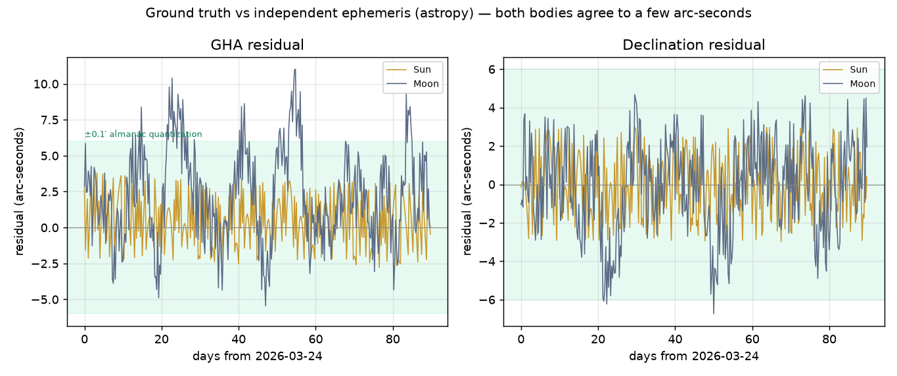

# Results — iPhone 17 Pro Sun+Moon daytime sighting with IMU + factor graph

*Epoch 2026-03-24 12:00 UTC, observer near Greenwich (51.5°N, 0°). Sun+Moon ~94° apart in azimuth. 8 seeds per cell; values are mean ± std of RMS position error in km.*

## Key findings

1. **Fusing many Sun+Moon shots with IMU cuts error 4–10×** versus a single-epoch two-body fix — from tens/hundreds of km down to 4 km (land), 8 km (air) and 25 km (sea).

2. **A single hand-held phone sight is a weak instrument.** The synthetic horizon's tilt error is ~6′ braced on land but grows to tens of arc-minutes at sea/air (vs ~1–2′ for a marine sextant), so the whole value is in fusing many shots, not in any one shot.

3. **The least-rotation shutter clearly helps on land and in the air** (≈2× lower error) by cutting the per-shot horizon noise 3–6×. **At sea it is a wash** — even the calmest swell instant is too tilted, so the IMU gravity horizon alone is not enough there.

4. **The ultrawide camera fixes the sea (and air) problem.** Shooting the ultrawide horizon at the same instant as the tele body gives an *optical* horizon that is immune to acceleration. It drops the sea fix from 27 km to **2.0 km** and the air fix from 9 km to **2.2 km** — bringing the moving platforms to land-class accuracy. On land there is no true sea horizon, so it falls back to the IMU (no change).

5. **The tele lens is more than a pointer.** Resolving the disk gives a magnetometer-free heading, but the two bodies are not equal: the **Sun's** sharp disk yields ~0.6° (vs ~1° for the phone compass), while the **Moon's bright limb** is only ~1.9° (phase-limited, and degenerate near full) — *looser than the magnetometer*. So in daytime the heading should come from the Sun; the Moon's limb is a night / Sun-occluded backup. Either way the disk adds a horizon-free parallactic line; on a weak (IMU) horizon at sea the optical stack cuts the fix from 29 km to 11 km.

6. **Geometry matters:** the fix is well-conditioned only when the Sun and Moon are well separated in azimuth (~90° here, a first-quarter Moon); near-parallel lines of position degrade it.

## Ground-truth validation — are the Sun/Moon positions right?

The whole study rests on the Sun/Moon positions from `starfix`'s almanac. Those are cross-checked here against an **independent** ephemeris (`astropy` — a separate implementation from the almanac's Skyfield/JPL source), over a 90-day grid. Residuals (arc-seconds):

| Body | GHA rms / max | Dec rms / max | in km |
|---|---|---|---|
| Sun | 1.9″ / 3.8″ | 1.7″ / 3.0″ | ~0.07 km |
| Moon | 4.0″ / 11.0″ | 2.4″ / 6.7″ | ~0.20 km |

Both bodies agree to a **few arc-seconds** — far below the study's arc-minute measurement noise — confirming the ground truth. The residual floor is the almanac's 0.1′ table quantization plus hourly linear interpolation.

> **This validation earned its keep.** The independent check first flagged a Moon-declination error of up to ~1.6° near the Dec≈0 crossings — a sign-handling bug in `starfix.parse_angle_string` for the almanac's `-00:MM.M` negative-zero-degree format (`float("-00")` is `-0.0`, and `-0.0 < 0` is `False`). It is now fixed; the Moon residual dropped from ~5700″ to a few arc-seconds. The study's canonical epoch (Moon at Dec +28°) was never affected. A **Stellarium** export can be added as a third witness — see `stellarium_reference.md`.

## The unified factor graph — everything fused

One graph fuses every observable at once. Per Sun+Moon shot there is a pose `X(i)` (position + attitude), a velocity `V(i)` and a shared IMU bias `B`; consecutive keyframes are tied by IMU preintegration, and each shot contributes six celestial factors (altitude, azimuth and parallactic line, for the Sun and the Moon).

**Observables fused** (and where each comes from):

- **Altitude** of Sun and Moon — tele pointing measured against the horizon reference. *Position lines.*
- **Horizon reference** = **IMU gravity** ⊕ **ultrawide optical horizon** (acceleration-immune, dip-corrected). *Sets the altitude covariance.*
- **Azimuth** of Sun and Moon — usable because the **tele-disk orientation** (Moon bright limb, Sun sunspot P-angle) gives a **magnetometer-free heading**. *Position lines.*
- **Parallactic angle q** of each body — the disk orientation vs. the vertical. *Independent, horizon-free position line.*
- **IMU preintegration** between shots (+ bias state). *Links the trajectory, smooths many fixes.*
- **Least-rotation gating** — selects the calm shutter instants that feed the graph.
- **Coarse position prior** (a stale ~30 km dead-reckoning). *Disambiguates; does not drive accuracy.*

Deployed accuracy of the **full fusion** (RMS km, 8 seeds):

| Regime | full fusion |
|---|---|
| Land (stationary) | **3.8 ± 1.6** |
| Sea (vessel + swell) | **2.2 ± 0.6** |
| Air (aircraft) | **2.3 ± 0.8** |

### What each observable is worth (leave-one-out)

Starting from the full fusion and removing one observable at a time:

| Regime | full fusion | - ultrawide horizon | - IMU link | - optical azimuth | - parallactic line | - gating | - Moon (Sun only) |
|---|---|---|---|---|---|---|---|
| Land (stationary) | 3.8 ± 1.6 | 3.8 ± 1.6 | 14.3 ± 1.5 | 3.1 ± 2.0 | 4.1 ± 2.3 | 5.5 ± 3.0 | 6.1 ± 3.5 |
| Sea (vessel + swell) | 2.2 ± 0.6 | 16.0 ± 8.2 | 7.7 ± 0.8 | 1.8 ± 1.0 | 2.1 ± 1.2 | 4.0 ± 1.8 | 5.6 ± 3.6 |
| Air (aircraft) | 2.3 ± 0.8 | 6.5 ± 4.5 | 8.1 ± 0.9 | 1.9 ± 1.1 | 2.2 ± 1.3 | 2.6 ± 0.9 | 5.3 ± 3.2 |

### Deliberately left out (and why)

- **Lunar distance for time/longitude.** The Sun-Moon separation (or the Moon's phase) gives chronometer-free GMT — but a phone already has an accurate clock, so time is known and this is not needed. It would matter only for a long clock outage.
- **Atmospheric refraction and the Moon's ~1° horizontal parallax.** Treated as pre-corrected here (geometric altitudes); `starfix.Sight` already models both and would be layered in for a field build.
- **Per-shot device attitude** is marginalised into the celestial factor covariances (the fused gravity/horizon/disk references), rather than carried as a free state — valid because the tilt errors are independent shot to shot.

## Real-time on iPhone 17 Pro — streaming fixed-lag smoother

The batch solver re-optimises the whole trajectory each fix, so latency grows with the voyage; the streaming estimator (`realtime.py`, `gtsam_unstable.IncrementalFixedLagSmoother`) marginalises keyframes older than a time window and preintegrates the IMU once online, so each per-shot update is **bounded and flat**. Fixes are low-rate (a gated shot every few seconds); IMU dead-reckoning gives the continuous position between them.

Per-fix latency at 30 shots (host CPU, single thread; an A19 Pro is comparable):

| Regime | batch re-solve | **streaming update** | speedup | final-error parity (batch / stream) |
|---|---|---|---|---|
| Land (stationary) | 332 ms | **5.6 ms** | 59× | 2.03 / 2.05 km |
| Sea (vessel + swell) | 333 ms | **5.2 ms** | 64× | 0.98 / 0.99 km |
| Air (aircraft) | 336 ms | **5.1 ms** | 66× | 1.15 / 1.15 km |

The streaming current-position estimate matches batch to ~0.02 km — same accuracy, bounded cost. (The dominant saving is doing IMU preintegration once online instead of re-preintegrating every leg on each batch solve; analytic Jacobians and the reduced two-DOF finite difference — only east/north affect a celestial factor — remove the rest.)

## Would an external 3× teleconverter help? No.

A clip-on afocal optic triples the tele focal length (sharper pointing, bigger disk), but the fix is **unchanged** — the system is limited by the horizon/attitude reference, not the camera. Full-fusion RMS (km) vs teleconverter:

| Regime | 1× | 2× | 3× |
|---|---|---|---|
| Land (stationary) | 2.9 ± 1.2 | 2.9 ± 1.2 | 2.9 ± 1.2 |
| Sea (vessel + swell) | 1.4 ± 0.7 | 1.4 ± 0.7 | 1.4 ± 0.7 |
| Air (aircraft) | 1.5 ± 0.8 | 1.5 ± 0.8 | 1.5 ± 0.8 |

Why: the altitude error budget is dominated by the horizon (optical ~3.8′, IMU ~70′ at sea), while camera pointing is ~0.03′ — already ~100× smaller, and 3× zoom only shrinks that already-negligible term. Heading is floored by astronomical/model residuals (libration, seeing, P-angle) that zoom cannot improve.

The lever that *would* help is a better **horizon/attitude** reference — a tripod/gimbal (kills the swell/tremor tilt), a longer ultrawide baseline, or a better AHRS — not more zoom. Downsides of a 3× optic: 3× narrower field (harder to acquire the body), more motion/blur sensitivity, and added weight/alignment/aberration.

## Wide vs. ultrawide horizon lens — an altitude question

All the phone's lenses point the same way, so to sight a body at altitude *h* the cluster aims at elevation *h* and the horizon sits *h* below the boresight. A lens captures the horizon only while *h* stays inside its field. The main **wide** lens gives a sharper horizon (less distortion) but its narrower field loses the horizon above ~30°; the **ultrawide** holds it to ~52°; above that neither sees it and the fix falls back to the IMU.

So it is the reverse of *"wide lens for high hours"*: **the wide lens is the LOW-altitude choice** (a sharper horizon for bodies below ~30°), while **high sights need the ultrawide** — and very high sights (>52°) lose the optical horizon entirely. At the canonical epoch (Moon ~32°, Sun ~40°) both bodies are already in the ultrawide zone, so forcing the wide lens loses the horizon and wrecks the fix:

| Regime | wide-only | ultrawide | adaptive |
|---|---|---|---|
| Sea (vessel + swell) | 16.0 ± 4.9 | 1.4 ± 1.0 | 1.4 ± 1.0 |
| Air (aircraft) | 4.8 ± 2.5 | 1.5 ± 1.0 | 1.5 ± 1.0 |

Practical guidance: for this method prefer **moderate-to-low body altitudes (~15–30°)** — the wide lens then delivers the sharpest horizon and refraction is still manageable (below ~15° refraction/dip uncertainty grows; `starfix` models it). High-noon sights are the worst case for the optical horizon.

## Sunspots as a visual anchor — increasing IMU precision

A tracked disk feature (a sunspot through a solar filter, or a Moon crater/limb) is a star-tracker landmark: its direction is **translation-invariant** (so it behaves the same moving or stationary) and **acceleration-immune**. Tracking it pins the gyro bias and gives a drift-free attitude.

Attitude/horizon error (arc-minutes):

| | gyro only | accelerometer-aided | **anchor-aided** |
|---|---|---|---|
| Stationary, after 120 s | 50′ (drifting) | 12′ | **1.7′** |
| Moving, after 30 s | 8′ | 526′ (motion-corrupted) | **2.1′** |

The gyro alone diverges (~0.17′/s); the accelerometer is bounded but wrecked by motion (~500′ while maneuvering); the anchor stays a few arc-minutes **whether moving or stationary**. That acceleration-immune attitude, plus the position estimate, gives a vertical/horizon that needs neither the accelerometer nor the sea horizon — so it **rescues the fix when the optical horizon is unavailable** (a high sight, a land skyline, or the horizon out of frame):

| Regime | optical horizon: no anchor / anchor | no optical horizon: no anchor / anchor |
|---|---|---|
| Land (stationary) | 3.8 ± 1.5 / **1.8 ± 0.6** | 3.8 ± 1.5 / **1.8 ± 0.6** |
| Sea (vessel + swell) | 1.9 ± 0.5 / **1.4 ± 0.4** | 19.6 ± 4.3 / **2.1 ± 0.7** |
| Air (aircraft) | 2.1 ± 0.7 / **1.5 ± 0.5** | 7.8 ± 2.6 / **2.0 ± 0.7** |

So the anchor is transformative exactly where the accelerometer and the optical horizon fail, and a modest sharpener elsewhere. Cost: it needs a body **continuously tracked** in the tele field (the Sun through a filter, or the Moon's features), and the anchored vertical is only as good as the position estimate (~1–2′ at a ~2 km fix).

## What if cloud obscures the tracked body?

Cloud hits both the **sight** for that body (no line of position) and the **visual anchor** (the gyro stops being calibrated). The system degrades gracefully: obscured shots are dropped, the fix continues on whatever is clear, and when both bodies are lost it **coasts** on the (freshly calibrated) IMU until the sky clears and it re-anchors.

**Graceful degradation** — fix RMS (km) vs cloud cover:

| Regime | 0% cloud | 15% cloud | 30% cloud | 45% cloud | 60% cloud | 75% cloud |
|---|---|---|---|---|---|---|
| Land (stationary) | 1.9 ± 0.8 | 2.3 ± 0.7 | 3.0 ± 0.8 | 3.1 ± 1.1 | 4.7 ± 4.9 | 4.1 ± 1.9 |
| Sea (vessel + swell) | 1.5 ± 0.7 | 2.0 ± 0.3 | 2.1 ± 0.5 | 2.4 ± 1.3 | 3.0 ± 1.4 | 4.2 ± 4.1 |
| Air (aircraft) | 1.6 ± 0.7 | 1.9 ± 0.5 | 2.1 ± 0.4 | 2.5 ± 1.2 | 2.2 ± 1.9 | 3.8 ± 3.1 |

**Coast budget** — when both bodies are clouded there are no new sights, so position dead-reckons on the IMU. The anchor's parting gift is a calibrated gyro, but the coast is ultimately limited by gyro random-walk:

| Outage | attitude error | DR position drift |
|---|---|---|
| 30 s | 7′ | 17 m |
| 60 s | 17′ | 91 m |
| 120 s | 46′ | 941 m |
| 300 s | 179′ | 22996 m |

So the practical coast budget is **~1–2 minutes** (sub-km) before attitude drift leaks into the position quadratically. One body clouded → carry on with the other; both clouded → coast a minute or two, then it's dead-reckoning until a gap in the cloud lets it re-anchor and snap back. Persistent overcast → celestial is unavailable, like any sextant.

## 1. Factor graph vs. the incumbent single-fix

| Regime | starfix single-fix (per-epoch RMS) | Factor graph, no IMU | **Factor graph + IMU** |
|---|---|---|---|
| Land (stationary) | 16.7 ± 1.5 | 16.7 ± 1.5 | **4.1 ± 2.1** |
| Sea (vessel + swell) | 241.0 ± 35.2 | 157.1 ± 102.4 | **25.4 ± 14.6** |
| Air (aircraft) | 75.5 ± 19.7 | 75.1 ± 19.3 | **7.7 ± 4.4** |

## 2. Least-rotation capture trigger

Modelled synthetic-horizon altitude noise at the chosen shutter instants (arc-minutes):

| Regime | gated (least-rotation) | ungated (periodic) |
|---|---|---|
| Land (stationary) | 6.4′ | 18.1′ |
| Sea (vessel + swell) | 95.9′ | 402.6′ |
| Air (aircraft) | 22.2′ | 138.3′ |

Resulting position error (factor graph + IMU):

| Regime | gated | ungated |
|---|---|---|
| Land (stationary) | 5.7 ± 2.4 | 7.7 ± 4.8 |
| Sea (vessel + swell) | 26.2 ± 14.5 | 23.1 ± 12.6 |
| Air (aircraft) | 8.6 ± 3.1 | 16.4 ± 9.6 |

## 3. Optical horizon from the ultrawide camera

The ultrawide and tele lenses fire together: the tele resolves the body, the ultrawide sees the visible horizon line. Fitting that line gives an *optical* local-vertical that — unlike the accelerometer — is not fooled by linear acceleration. Modelled horizon-reference noise at gated motion (arc-minutes):

| Regime | IMU gravity | ultrawide optical | fused | dip corrected |
|---|---|---|---|---|
| Land (stationary) | 12.1′ | 12.1′ *(no true horizon → n/a)* | 12.1′ | 3′ |
| Sea (vessel + swell) | 70.4′ | 3.8′ | 3.7′ | 3′ |
| Air (aircraft) | 105.3′ | 3.7′ | 3.7′ | 177′ |

Resulting position error (factor graph + IMU, gated):

| Regime | IMU horizon | ultrawide horizon | **fused** |
|---|---|---|---|
| Land (stationary) | 4.2 ± 2.3 | 4.2 ± 2.3 | **4.2 ± 2.3** |
| Sea (vessel + swell) | 26.6 ± 15.8 | 2.0 ± 1.1 | **2.0 ± 1.1** |
| Air (aircraft) | 8.7 ± 4.8 | 2.3 ± 1.3 | **2.2 ± 1.2** |

## 4. Tele-resolved disk: magnetometer-free heading + parallactic line

The tele lens resolves the disk, not just a dot. The Moon's bright limb (and the Sun's sunspot P-angle) give an *absolute* celestial orientation in the image. Measured against the gravity vertical, it yields the parallactic angle *q(lat, lon)* — a heading reference that needs no magnetometer, and an independent, horizon-free position line.

Heading sigma (degrees) — magnetometer vs. optical disk:

| Regime | magnetometer | optical (Moon limb) |
|---|---|---|
| Land (stationary) | 1.0° | 1.9° |
| Sea (vessel + swell) | 1.0° | 1.9° |
| Air (aircraft) | 1.0° | 1.9° |

Position error (factor graph + IMU, gated, **IMU horizon** so the optical gain is visible):

| Regime | altitude only | + az (magnetometer) | + az (optical) | **+ optical az & parallactic** |
|---|---|---|---|---|
| Land (stationary) | 5.4 ± 0.8 | 3.6 ± 1.9 | 3.6 ± 1.9 | **2.6 ± 0.9** |
| Sea (vessel + swell) | 28.6 ± 15.8 | 17.3 ± 11.0 | 15.3 ± 11.4 | **11.4 ± 3.8** |
| Air (aircraft) | 12.0 ± 6.0 | 8.4 ± 5.4 | 7.9 ± 5.2 | **4.8 ± 1.9** |

The optical disk gives a heading several times better than the magnetometer, which is what makes the azimuth lines of position usable; combined with the parallactic line it materially improves the fix when the horizon is weak (e.g. sea on the IMU horizon). The Sun's P-angle needs a solar filter and visible spots (matched to an observatory reference taken just before the journey), so the Moon's bright limb is the workhorse.

> **Why the numbers above are larger than §3.** This section runs the optical disk on the *weak IMU horizon* on purpose, to isolate its contribution. It is not a regression versus the ~2 km ultrawide horizon — the two use different horizon baselines. Stacking *everything* (ultrawide fused horizon **and** the optical disk, Moon + Sun) gives the deployed accuracy below:

| Regime | ultrawide horizon only | **full stack (horizon + optical)** |
|---|---|---|
| Land (stationary) | 5.2 ± 2.2 | **4.5 ± 2.0** |
| Sea (vessel + swell) | 2.7 ± 1.2 | **2.4 ± 1.1** |
| Air (aircraft) | 2.8 ± 1.2 | **2.6 ± 1.2** |

## 5. Error vs. number of fused shots

## 6. The trigger in action

## 7. Fix with covariance (error ellipse)

## Model assumptions

- Representative phone-class MEMS IMU and periscope tele camera (see `iphone_model.py`); numbers are order-of-magnitude, not datasheet values.
- Spherical Earth; observer positions geocentric; Sun/Moon ephemeris reused verbatim from `starfix` (real nautical almanac).
- Altitudes are geometric (refraction/parallax/semidiameter treated as pre-corrected). A ~30 km dead-reckoning offset seeds the coarse prior, so reported accuracy comes from the sky, not the prior.
- The synthetic horizon comes from the phone's gravity vector (no sea-horizon dip); its dominant error is IMU tilt, which the least-rotation shutter minimises.
