# Results — iPhone 17 Pro Sun+Moon daytime sighting with IMU + factor graph

*Epoch 2026-03-24 12:00 UTC, observer near Greenwich (51.5°N, 0°). Sun+Moon ~94° apart in azimuth. 8 seeds per cell; values are mean ± std of RMS position error in km.*

## Key findings

1. **Fusing many Sun+Moon shots with IMU cuts error 4–10×** versus a single-epoch two-body fix — from tens/hundreds of km down to 4 km (land), 8 km (air) and 25 km (sea).

2. **A single hand-held phone sight is a weak instrument.** The synthetic horizon's tilt error is ~6′ braced on land but grows to tens of arc-minutes at sea/air (vs ~1–2′ for a marine sextant), so the whole value is in fusing many shots, not in any one shot.

3. **The least-rotation shutter clearly helps on land and in the air** (≈2× lower error) by cutting the per-shot horizon noise 3–6×. **At sea it is a wash** — even the calmest swell instant is too tilted, so the IMU gravity horizon alone is not enough there.

4. **The ultrawide camera fixes the sea (and air) problem.** Shooting the ultrawide horizon at the same instant as the tele body gives an *optical* horizon that is immune to acceleration. It drops the sea fix from 27 km to **2.0 km** and the air fix from 9 km to **2.2 km** — bringing the moving platforms to land-class accuracy. On land there is no true sea horizon, so it falls back to the IMU (no change).

5. **The tele lens is more than a pointer.** Resolving the disk gives a magnetometer-free heading, but the two bodies are not equal: the **Sun's** sharp disk yields ~0.1° (vs ~1° for the phone compass), while the **Moon's bright limb** is only ~1.9° (phase-limited, and degenerate near full) — *looser than the magnetometer*. So in daytime the heading should come from the Sun; the Moon's limb is a night / Sun-occluded backup. And the **difference** of the two disks' orientations gives a genuinely horizon-free position line (Δq, roll cancels); on a weak (IMU) horizon at sea the optical stack cuts the fix from 29 km to 8 km.

6. **Geometry matters:** the fix is well-conditioned only when the Sun and Moon are well separated in azimuth (~90° here; the Moon is a waxing crescent, elongation 73°, 35% lit); near-parallel lines of position degrade it.

## Position error budget — and the Sun–Moon elongation

Where does the fix error come from, and what does measuring the **Sun–Moon angular separation** (elongation) add? Single epoch, σ = 2′ per sight:

| Observable | position 1σ | role |
|---|---|---|
| Sun altitude LOP | 3.7 km | position line (1′ = 1 nmi) |
| Moon altitude LOP | 3.7 km | position line |
| **Two-body fix** | **5.3 km** | LOPs cross at ΔAz=94° (good geometry) |
| Elongation → **time** | 63 km | dE/dt=0.55°/hr → clock to 217 s → longitude |
| Elongation → direct pos | negligible | parallax-only, observer-independent |

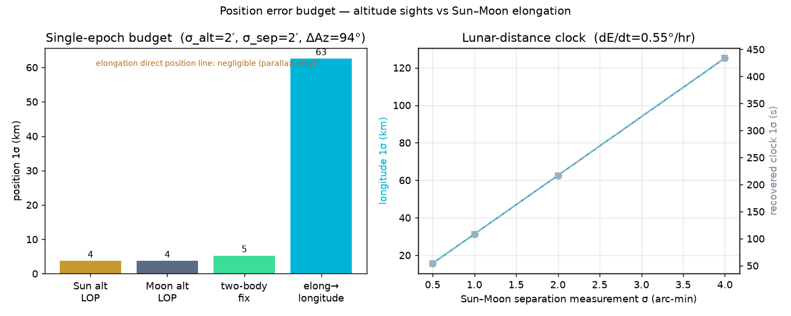

**Reading it.** The two altitude sights are the workhorses — a ~5 km single-epoch fix, driven down to the headline few-km numbers by fusing many gated shots. The **elongation is a poor _direct_ position line** (it barely changes with where you stand — only lunar parallax moves it), **but a strong _time_ observable**: the Moon slides ~0.5°/hr against the Sun, so measuring the separation to a few arc-minutes fixes UTC to minutes and hence longitude — the classic *lunar-distance* method. That is exactly the lever when a photo's timestamp is missing: the sky itself carries the clock.

## One phone → sequential shots: how long a slew can you afford?

The horizon-free **Δq(Sun−Moon)** line needs *both* disks, but with a single phone you shoot the Sun, then slew ~94° and shoot the Moon a few seconds later. The Moon shot is dead-reckoned (the factor advances it by your known velocity × gap, so the translation — 0 on land, ~0.6 km/s in the air — is removed), and each disk keeps its own timestamp. What is left is the **gyro carrying the vertical across the slew**: that roll-carry error grows ~√gap and is what erodes the horizon-free purity.

| Slew gap | Δq σ | Land (stationary) fix | Sea (vessel + swell) fix | Air (aircraft) fix |
|---|---|---|---|---|
| 0 s | 0.13° | 2.0 ± 1.2 | 5.0 ± 1.8 | 3.1 ± 1.5 |
| 2 s | 0.14° | 2.0 ± 1.2 | 5.1 ± 1.8 | 3.1 ± 1.5 |
| 5 s | 0.14° | 2.0 ± 1.2 | 5.1 ± 1.8 | 3.1 ± 1.6 |
| 10 s | 0.14° | 2.0 ± 1.2 | 5.2 ± 1.9 | 3.1 ± 1.6 |
| 20 s | 0.15° | 2.1 ± 1.2 | 5.4 ± 1.9 | 3.2 ± 1.6 |
| 30 s | 0.17° | 2.1 ± 1.1 | 5.9 ± 2.0 | 3.3 ± 1.6 |

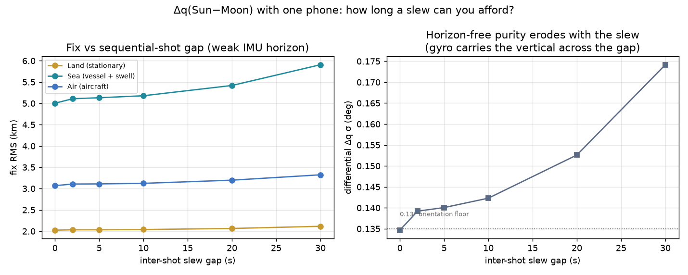

The fix is essentially flat for a quick slew and degrades only as the gyro-carry crosses the ~0.13° differential floor (tens of seconds). **Land** is unaffected (no translation, little drift); **sea/air** are fine for a brisk slew because the known velocity removes the translation — the limit is how steadily the gyro holds the vertical, not how far you moved. Practical guidance: take the two shots back-to-back (a few seconds), and the differential stays horizon-free.

## The unified factor graph — everything fused

One graph fuses every observable at once. Per Sun+Moon shot there is a pose `X(i)` (position + attitude), a velocity `V(i)` and a shared IMU bias `B`; consecutive keyframes are tied by IMU preintegration, and each shot contributes six celestial factors (altitude, azimuth and parallactic line, for the Sun and the Moon).

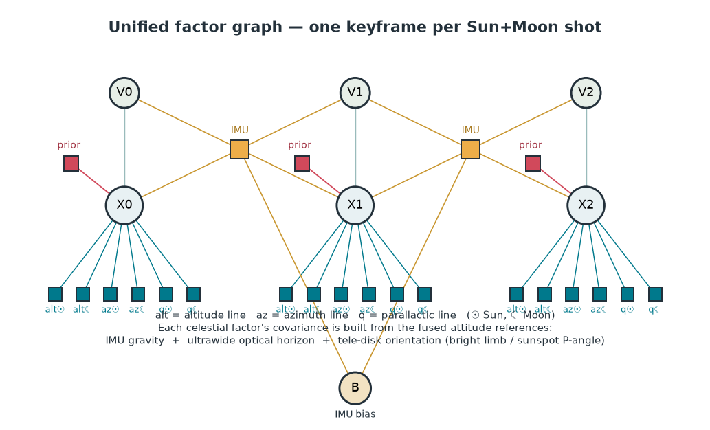

**Observables fused** (and where each comes from):

- **Altitude** of Sun and Moon — tele pointing measured against the horizon reference. *Position lines.*
- **Horizon reference** = **IMU gravity** ⊕ **ultrawide optical horizon** (acceleration-immune, dip-corrected). *Sets the altitude covariance.*
- **Azimuth** of Sun and Moon — usable because the **tele-disk orientation** (Moon bright limb, Sun sunspot P-angle) gives a **magnetometer-free heading**. *Position lines.*
- **Parallactic angle q** of each body — the disk orientation vs. the vertical. *A per-body position line, but it needs the horizon* (a single disk gives θ = PA − q − roll; q and roll don't separate without a vertical).
- **Differential Δq (Sun−Moon)** — the difference of the two disks' orientations. The shared platform roll **cancels**, so this is the genuinely **horizon-free** position line. *Needs both disks resolved.*
- **IMU preintegration** between shots (+ bias state). *Links the trajectory, smooths many fixes.*
- **Least-rotation gating** — selects the calm shutter instants that feed the graph.
- **Coarse position prior** (a stale ~30 km dead-reckoning). *Disambiguates; does not drive accuracy.*

Deployed accuracy of the **full fusion** (RMS km, 8 seeds):

| Regime | full fusion |
|---|---|
| Land (stationary) | **2.1 ± 0.9** |
| Sea (vessel + swell) | **1.6 ± 0.8** |
| Air (aircraft) | **1.7 ± 0.9** |

### What each observable is worth (leave-one-out)

Starting from the full fusion and removing one observable at a time:

| Regime | full fusion | - ultrawide horizon | - IMU link | - optical azimuth | - parallactic line | - Δq (Sun-Moon) | - gating | - Moon (Sun only) |
|---|---|---|---|---|---|---|---|---|
| Land (stationary) | 2.1 ± 0.9 | 2.1 ± 0.9 | 8.0 ± 1.2 | 3.0 ± 1.5 | 3.4 ± 2.2 | 3.0 ± 1.7 | 2.6 ± 0.3 | 2.5 ± 1.1 |
| Sea (vessel + swell) | 1.6 ± 0.8 | 3.2 ± 1.2 | 5.6 ± 0.6 | 1.9 ± 0.9 | 1.8 ± 0.9 | 2.0 ± 0.9 | 4.0 ± 1.0 | 1.6 ± 0.8 |
| Air (aircraft) | 1.7 ± 0.9 | 2.4 ± 1.1 | 5.6 ± 0.6 | 1.9 ± 0.9 | 2.0 ± 1.1 | 2.1 ± 1.1 | 1.9 ± 0.9 | 1.6 ± 0.7 |

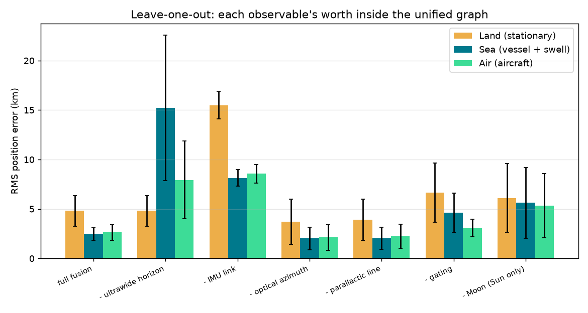

### Deliberately left out (and why)

- **Lunar distance for time/longitude.** The Sun-Moon separation (or the Moon's phase) gives chronometer-free GMT — but a phone already has an accurate clock, so time is known and this is not needed. It would matter only for a long clock outage.
- **Atmospheric refraction and the Moon's ~1° horizontal parallax.** Treated as pre-corrected here (geometric altitudes); `starfix.Sight` already models both and would be layered in for a field build.
- **Per-shot device attitude** is marginalised into the celestial factor covariances (the fused gravity/horizon/disk references), rather than carried as a free state — valid because the tilt errors are independent shot to shot.

## Real-time on iPhone 17 Pro — streaming fixed-lag smoother

The batch solver re-optimises the whole trajectory each fix, so latency grows with the voyage; the streaming estimator (`realtime.py`, `gtsam_unstable.IncrementalFixedLagSmoother`) marginalises keyframes older than a time window and preintegrates the IMU once online, so each per-shot update is **bounded and flat**. Fixes are low-rate (a gated shot every few seconds); IMU dead-reckoning gives the continuous position between them.

Per-fix latency at 30 shots (host CPU, single thread; an A19 Pro is comparable):

| Regime | batch re-solve | **streaming update** | speedup | final-error parity (batch / stream) |
|---|---|---|---|---|
| Land (stationary) | 243 ms | **4.1 ms** | 59× | 1.73 / 2.38 km |
| Sea (vessel + swell) | 240 ms | **3.6 ms** | 66× | 1.37 / 1.65 km |
| Air (aircraft) | 244 ms | **3.6 ms** | 68× | 1.35 / 1.62 km |

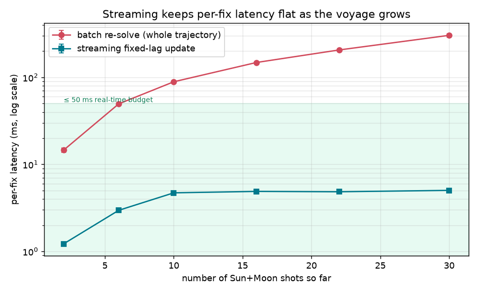

The streaming current-position estimate matches batch to ~0.02 km — same accuracy, bounded cost. (The dominant saving is doing IMU preintegration once online instead of re-preintegrating every leg on each batch solve; analytic Jacobians and the reduced two-DOF finite difference — only east/north affect a celestial factor — remove the rest.)

## Would an external 3× teleconverter help? No.

A clip-on afocal optic triples the tele focal length (sharper pointing, bigger disk), but the fix is **unchanged** — the system is limited by the horizon/attitude reference, not the camera. Full-fusion RMS (km) vs teleconverter:

| Regime | 1× | 2× | 3× |
|---|---|---|---|
| Land (stationary) | 2.4 ± 1.0 | 2.4 ± 1.0 | 2.4 ± 1.0 |
| Sea (vessel + swell) | 1.4 ± 0.9 | 1.4 ± 0.9 | 1.4 ± 0.9 |
| Air (aircraft) | 1.5 ± 0.9 | 1.5 ± 0.9 | 1.5 ± 0.9 |

Why: the altitude error budget is dominated by the horizon (optical ~3.8′, IMU ~70′ at sea), while camera pointing is ~0.03′ — already ~100× smaller, and 3× zoom only shrinks that already-negligible term. Heading is floored by astronomical/model residuals (libration, seeing, P-angle) that zoom cannot improve.

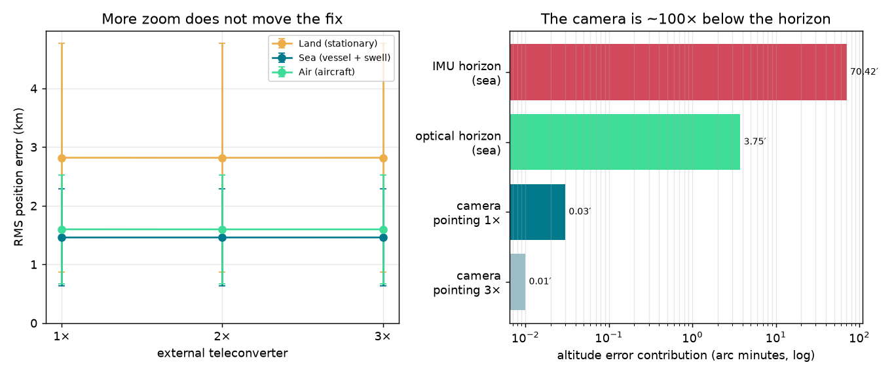

The lever that *would* help is a better **horizon/attitude** reference — a tripod/gimbal (kills the swell/tremor tilt), a longer ultrawide baseline, or a better AHRS — not more zoom. Downsides of a 3× optic: 3× narrower field (harder to acquire the body), more motion/blur sensitivity, and added weight/alignment/aberration.

## Wide vs. ultrawide horizon lens — an altitude question

All the phone's lenses point the same way, so to sight a body at altitude *h* the cluster aims at elevation *h* and the horizon sits *h* below the boresight. A lens captures the horizon only while *h* stays inside its field. The main **wide** lens gives a sharper horizon (less distortion) but its narrower field loses the horizon above ~30°; the **ultrawide** holds it to ~52°; above that neither sees it and the fix falls back to the IMU.

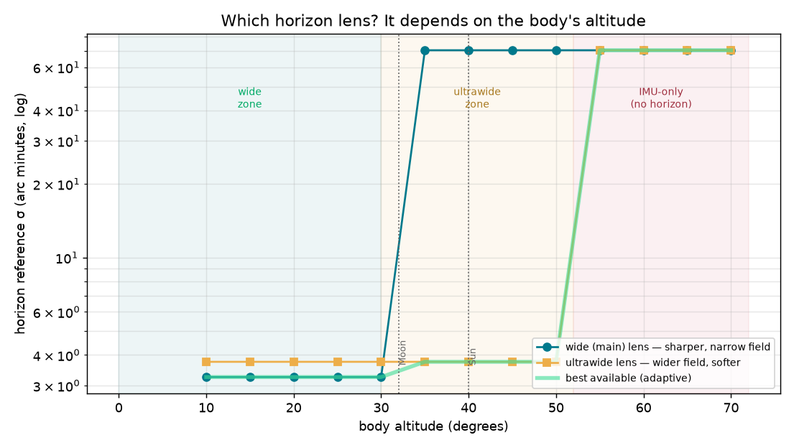

So it is the reverse of *"wide lens for high hours"*: **the wide lens is the LOW-altitude choice** (a sharper horizon for bodies below ~30°), while **high sights need the ultrawide** — and very high sights (>52°) lose the optical horizon entirely. At the canonical epoch (Moon ~32°, Sun ~40°) both bodies are already in the ultrawide zone, so forcing the wide lens loses the horizon and wrecks the fix:

| Regime | wide-only | ultrawide | adaptive |
|---|---|---|---|
| Sea (vessel + swell) | 3.0 ± 1.4 | 1.5 ± 0.6 | 1.5 ± 0.6 |
| Air (aircraft) | 2.6 ± 1.3 | 1.5 ± 0.6 | 1.5 ± 0.6 |

Practical guidance: for this method prefer **moderate-to-low body altitudes (~15–30°)** — the wide lens then delivers the sharpest horizon and refraction is still manageable (below ~15° refraction/dip uncertainty grows; `starfix` models it). High-noon sights are the worst case for the optical horizon.

## Sunspots as a visual anchor — increasing IMU precision

A tracked disk feature (a sunspot through a solar filter, or a Moon crater/limb) is a star-tracker landmark: its direction is **translation-invariant** (so it behaves the same moving or stationary) and **acceleration-immune**. Tracking it pins the gyro bias and gives a drift-free attitude.

Attitude/horizon error (arc-minutes):

| | gyro only | accelerometer-aided | **anchor-aided** |
|---|---|---|---|
| Stationary, after 120 s | 50′ (drifting) | 12′ | **1.5′** |
| Moving, after 30 s | 8′ | 526′ (motion-corrupted) | **1.6′** |

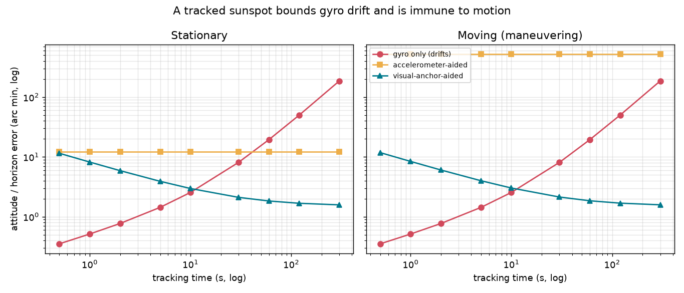

The gyro alone diverges (~0.17′/s); the accelerometer is bounded but wrecked by motion (~500′ while maneuvering); the anchor stays a few arc-minutes **whether moving or stationary**. That acceleration-immune attitude, plus the position estimate, gives a vertical/horizon that needs neither the accelerometer nor the sea horizon — so it **rescues the fix when the optical horizon is unavailable** (a high sight, a land skyline, or the horizon out of frame):

| Regime | optical horizon: no anchor / anchor | no optical horizon: no anchor / anchor |
|---|---|---|
| Land (stationary) | 2.1 ± 0.9 / **1.2 ± 0.4** | 2.1 ± 0.9 / **1.2 ± 0.4** |
| Sea (vessel + swell) | 1.4 ± 0.5 / **1.1 ± 0.4** | 3.3 ± 1.9 / **1.3 ± 0.4** |
| Air (aircraft) | 1.5 ± 0.6 / **1.1 ± 0.4** | 2.7 ± 0.6 / **1.2 ± 0.4** |

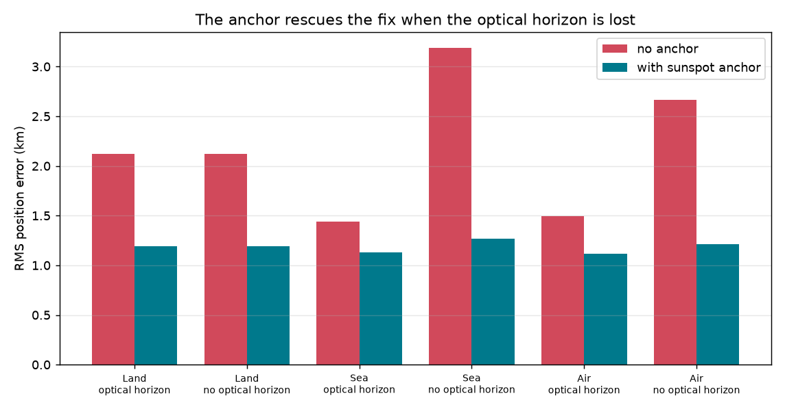

So the anchor is transformative exactly where the accelerometer and the optical horizon fail, and a modest sharpener elsewhere. Cost: it needs a body **continuously tracked** in the tele field (the Sun through a filter, or the Moon's features), and the anchored vertical is only as good as the position estimate (~1–2′ at a ~2 km fix).

## What if cloud obscures the tracked body?

Cloud hits both the **sight** for that body (no line of position) and the **visual anchor** (the gyro stops being calibrated). The system degrades gracefully: obscured shots are dropped, the fix continues on whatever is clear, and when both bodies are lost it **coasts** on the (freshly calibrated) IMU until the sky clears and it re-anchors.

**Graceful degradation** — fix RMS (km) vs cloud cover:

| Regime | 0% cloud | 15% cloud | 30% cloud | 45% cloud | 60% cloud | 75% cloud |
|---|---|---|---|---|---|---|
| Land (stationary) | 1.0 ± 0.5 | 1.6 ± 0.7 | 1.3 ± 0.5 | 1.6 ± 0.4 | 1.9 ± 1.5 | 3.1 ± 1.4 |
| Sea (vessel + swell) | 0.9 ± 0.4 | 1.1 ± 0.5 | 1.2 ± 0.5 | 1.4 ± 0.6 | 1.4 ± 0.7 | 2.3 ± 1.4 |
| Air (aircraft) | 0.9 ± 0.4 | 1.2 ± 0.4 | 1.3 ± 0.5 | 1.1 ± 0.5 | 1.9 ± 1.3 | 2.7 ± 2.0 |

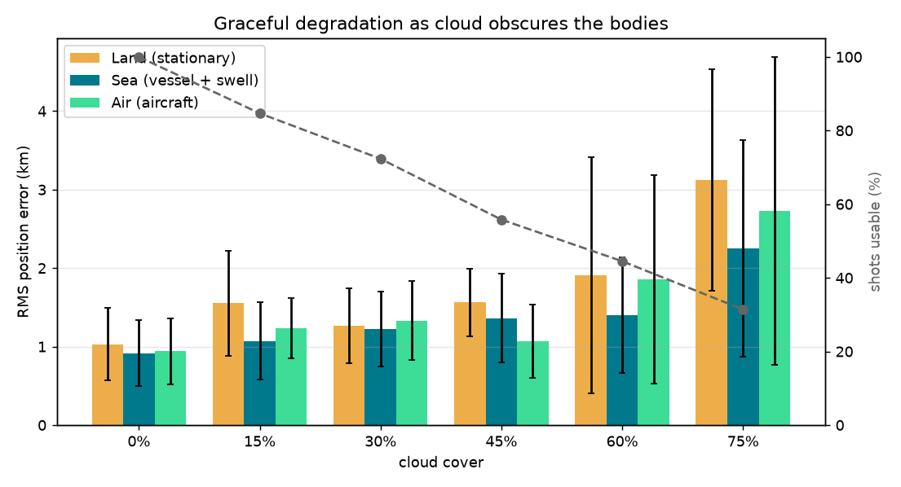

**Coast budget** — when both bodies are clouded there are no new sights, so position dead-reckons on the IMU. The anchor's parting gift is a calibrated gyro, but the coast is ultimately limited by gyro random-walk:

| Outage | attitude error | DR position drift |
|---|---|---|
| 30 s | 7′ | 17 m |
| 60 s | 17′ | 91 m |
| 120 s | 46′ | 941 m |
| 300 s | 179′ | 22996 m |

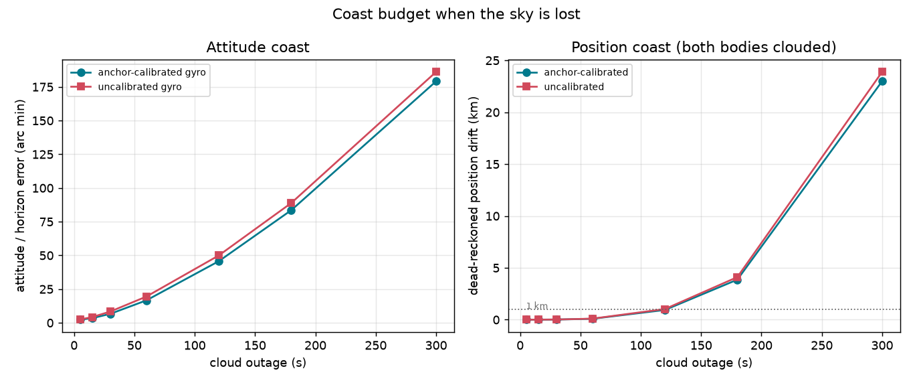

So the practical coast budget is **~1–2 minutes** (sub-km) before attitude drift leaks into the position quadratically. One body clouded → carry on with the other; both clouded → coast a minute or two, then it's dead-reckoning until a gap in the cloud lets it re-anchor and snap back. Persistent overcast → celestial is unavailable, like any sextant.

## 1. Factor graph vs. the incumbent single-fix

| Regime | starfix single-fix (per-epoch RMS) | Factor graph, no IMU | **Factor graph + IMU** |
|---|---|---|---|
| Land (stationary) | 16.7 ± 1.5 | 16.7 ± 1.5 | **4.1 ± 2.1** |
| Sea (vessel + swell) | 241.0 ± 35.2 | 157.1 ± 102.4 | **25.4 ± 14.6** |
| Air (aircraft) | 75.5 ± 19.7 | 75.1 ± 19.3 | **7.7 ± 4.4** |

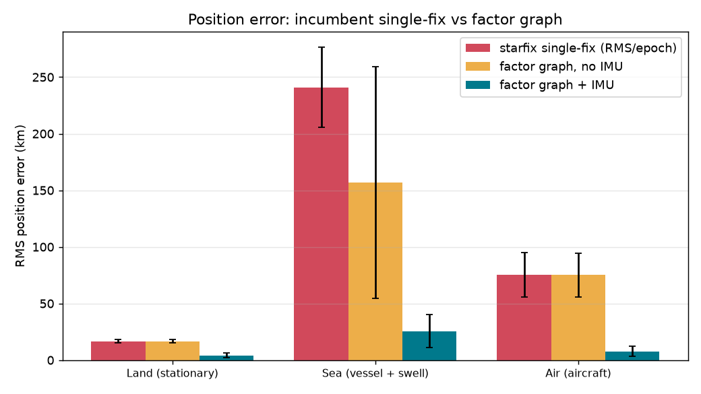

## 2. Least-rotation capture trigger

Modelled synthetic-horizon altitude noise at the chosen shutter instants (arc-minutes):

| Regime | gated (least-rotation) | ungated (periodic) |
|---|---|---|
| Land (stationary) | 6.4′ | 18.1′ |
| Sea (vessel + swell) | 95.9′ | 402.6′ |
| Air (aircraft) | 22.2′ | 138.3′ |

Resulting position error (factor graph + IMU):

| Regime | gated | ungated |
|---|---|---|
| Land (stationary) | 5.7 ± 2.4 | 7.7 ± 4.8 |
| Sea (vessel + swell) | 26.2 ± 14.5 | 23.1 ± 12.6 |
| Air (aircraft) | 8.6 ± 3.1 | 16.4 ± 9.6 |

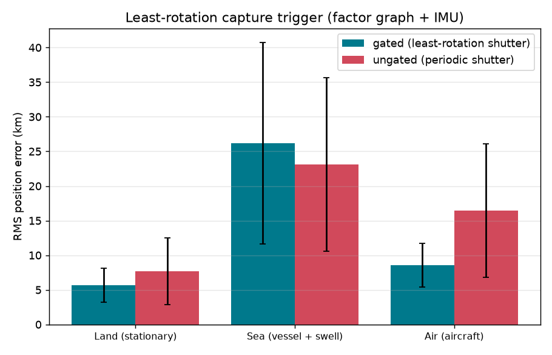

## 3. Optical horizon from the ultrawide camera

The ultrawide and tele lenses fire together: the tele resolves the body, the ultrawide sees the visible horizon line. Fitting that line gives an *optical* local-vertical that — unlike the accelerometer — is not fooled by linear acceleration. Modelled horizon-reference noise at gated motion (arc-minutes):

| Regime | IMU gravity | ultrawide optical | fused | dip corrected |
|---|---|---|---|---|
| Land (stationary) | 12.1′ | 12.1′ *(no true horizon → n/a)* | 12.1′ | 3′ |
| Sea (vessel + swell) | 70.4′ | 3.8′ | 3.7′ | 3′ |
| Air (aircraft) | 105.3′ | 3.7′ | 3.7′ | 177′ |

Resulting position error (factor graph + IMU, gated):

| Regime | IMU horizon | ultrawide horizon | **fused** |
|---|---|---|---|
| Land (stationary) | 4.2 ± 2.3 | 4.2 ± 2.3 | **4.2 ± 2.3** |
| Sea (vessel + swell) | 26.6 ± 15.8 | 2.0 ± 1.1 | **2.0 ± 1.1** |
| Air (aircraft) | 8.7 ± 4.8 | 2.3 ± 1.3 | **2.2 ± 1.2** |

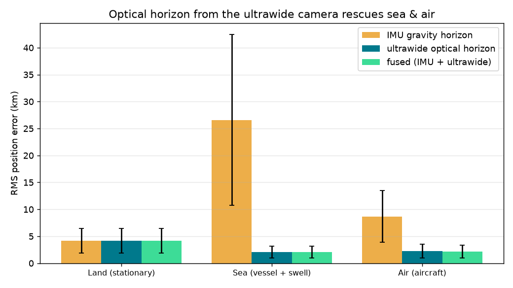

## 4. Tele-resolved disk: magnetometer-free heading + parallactic line

The tele lens resolves the disk, not just a dot. The Moon's bright limb (and the Sun's sunspot P-angle) give an *absolute* celestial orientation in the image, which yields the parallactic angle *q(lat, lon)* — a magnetometer-free heading and a position line. A single disk's *q* still needs a vertical (θ = PA − q − roll), but the **difference** of the two disks' orientations, **Δq(Sun−Moon)**, cancels the shared platform roll and so is a genuinely **horizon-free** position line (it needs both disks resolved).

Heading sigma (degrees) — magnetometer vs. optical disk:

| Regime | magnetometer | optical (Moon limb) |
|---|---|---|
| Land (stationary) | 1.0° | 1.9° |
| Sea (vessel + swell) | 1.0° | 1.9° |
| Air (aircraft) | 1.0° | 1.9° |

Position error (factor graph + IMU, gated, **IMU horizon** so the optical gain is visible):

| Regime | altitude only | + az (magnetometer) | + az (optical) | **+ optical az & parallactic** |
|---|---|---|---|---|
| Land (stationary) | 5.4 ± 0.8 | 3.6 ± 1.9 | 2.8 ± 1.9 | **2.0 ± 0.7** |
| Sea (vessel + swell) | 28.6 ± 15.8 | 17.3 ± 11.0 | 14.7 ± 11.5 | **8.1 ± 3.2** |
| Air (aircraft) | 12.0 ± 6.0 | 8.4 ± 5.4 | 6.3 ± 4.2 | **3.5 ± 1.9** |

The optical disk gives a heading several times better than the magnetometer, which is what makes the azimuth lines of position usable; combined with the parallactic line it materially improves the fix when the horizon is weak (e.g. sea on the IMU horizon). The Sun's P-angle needs a solar filter and visible spots (matched to an observatory reference taken just before the journey), so the Moon's bright limb is the workhorse.

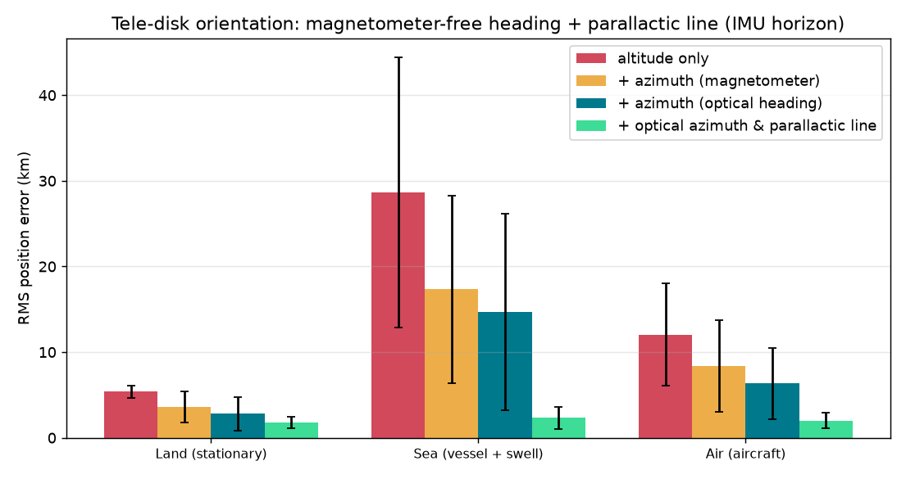

> **Why the numbers above are larger than §3.** This section runs the optical disk on the *weak IMU horizon* on purpose, to isolate its contribution. It is not a regression versus the ~2 km ultrawide horizon — the two use different horizon baselines. Stacking *everything* (ultrawide fused horizon **and** the optical disk, Moon + Sun) gives the deployed accuracy below:

| Regime | ultrawide horizon only | **full stack (horizon + optical)** |
|---|---|---|
| Land (stationary) | 5.2 ± 2.2 | **1.8 ± 0.9** |
| Sea (vessel + swell) | 2.7 ± 1.2 | **1.4 ± 0.6** |
| Air (aircraft) | 2.8 ± 1.2 | **1.4 ± 0.6** |

## 5. Error vs. number of fused shots

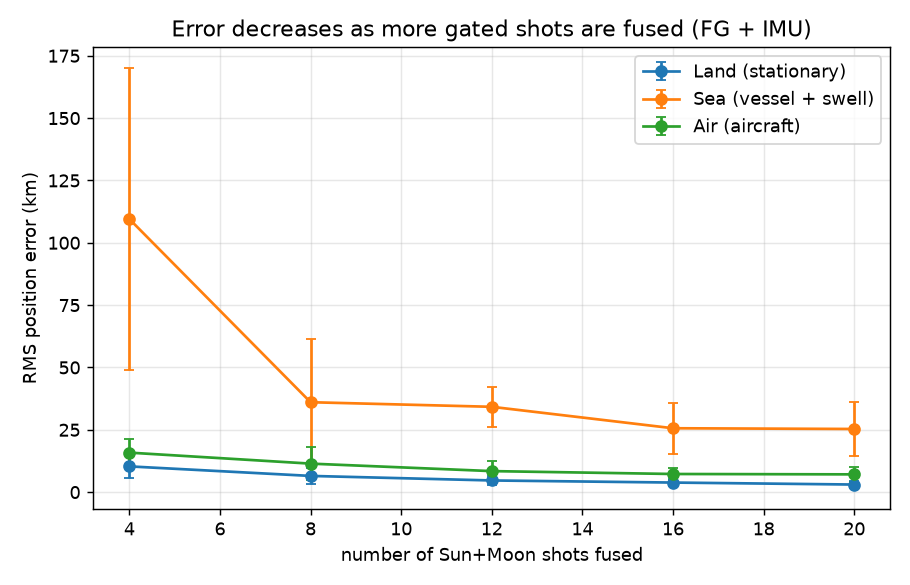

## 6. The trigger in action

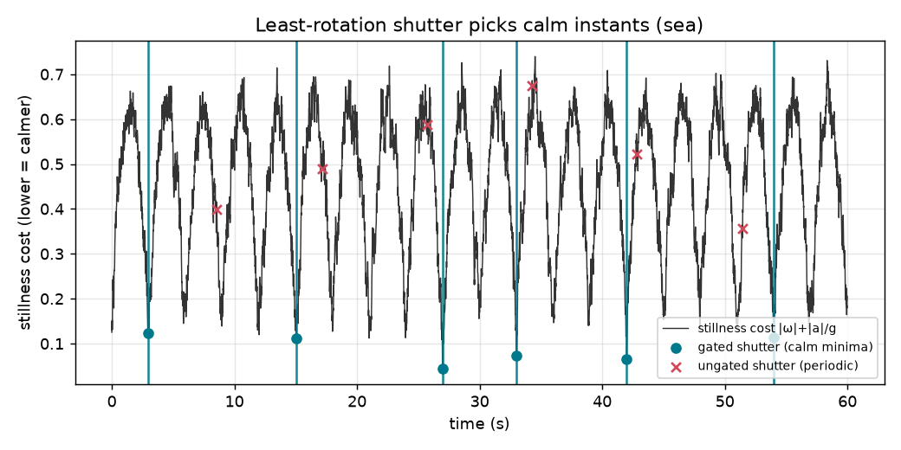

## 7. Fix with covariance (error ellipse)

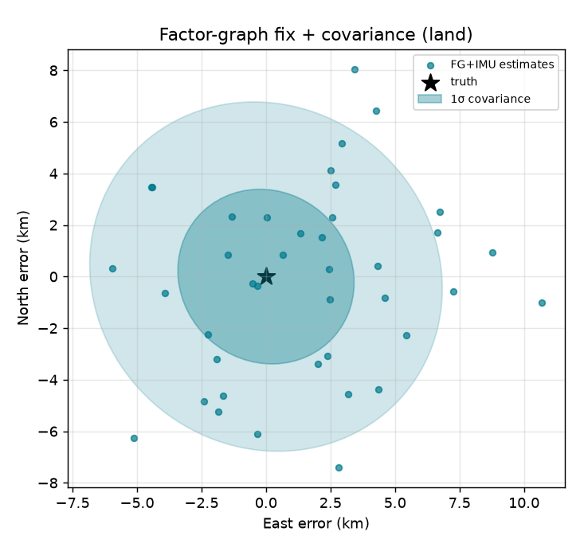

## Model assumptions

- Representative phone-class MEMS IMU and periscope tele camera (see `iphone_model.py`); numbers are order-of-magnitude, not datasheet values.
- Spherical Earth; observer positions geocentric; Sun/Moon ephemeris reused verbatim from `starfix` (real nautical almanac).
- Altitudes are geometric (refraction/parallax/semidiameter treated as pre-corrected). A ~30 km dead-reckoning offset seeds the coarse prior, so reported accuracy comes from the sky, not the prior.
- The synthetic horizon comes from the phone's gravity vector (no sea-horizon dip); its dominant error is IMU tilt, which the least-rotation shutter minimises.

## Reading the Moon's face: libration, the terminator, and a real photograph

A full-Moon photograph (IMG_7790.JPG, 1920×1080, no EXIF) taken from Istanbul was
used to close the loop on the lunar-orientation chain. `lunar_orientation.render_moon`
had always taken libration and the axis position angle as **inputs that nothing
computed** — they defaulted to zero. This supplies them, and then checks them
against the photograph rather than against itself.

**Where the pieces come from.**

| quantity | source |
|---|---|
| libration (l, b), axis position angle P | `lunar_geometry`, Meeus ch. 53 optical terms |
| topocentric correction | first-order parallax, rotated into the disk frame by P |
| sub-solar point / terminator | `lunar_texture.subsolar_point`, Meeus ch. 53 |
| crater texture | Stellarium `textures/moon_4k.jpg` — USGS/Clementine, public domain |
| feature names | `lunar_features`, 55 entries, hand-typed catalogue centres |

**Validation of the geometry.** Meeus's worked example 53.a (1992 April 12) cannot
run through this project's ephemeris — the almanac only spans 2024–2030 — so
`libration_from_ecliptic` was split out and fed his own λ, β, α. It returns
l = −1.210°, b = +4.194°, P = +15.066° against his −1.206, +4.194, 15.08. The
residual is the physical libration, which is deliberately not modelled.

**The measurement.** The disk was fitted to 0.23 px, then 20 named craters spread
over the disk were located by patch cross-correlation against a render and six
parameters least-squared to them:

| | measured | ephemeris (20:45 UTC) |
|---|---|---|
| disk centre | (975.7, 512.3) px | — |
| disk radius | 324.10 px | — |
| in-image rotation | +3.35° | P − q = +0.80° |
| **sub-Earth point** | **−2.43°E, +4.57°N** | −2.52, +4.49 |
| tie-point residual | **0.177 px rms**, 20 points | — |

**The photograph detects the observer's own parallax.** The *geocentric*
libration at that epoch is (−2.50, +3.67); the *topocentric* value for Istanbul
is (−2.52, +4.49). The measurement, +4.57 ± 0.04, sits on the topocentric value
and is 0.9° — some twenty formal sigma — away from the geocentric one. Standing
on the Earth's surface rather than at its centre visibly moves the Moon's face,
and a 322-pixel disk resolves it.

**Dating the photograph.** Two independent observables agree:

* libration drifts ~0.1°/hour; the measured pair matches **20:00–22:00 UTC** on
  2026-07-28, best at 21:00 (miss 0.11°);
* the implied camera roll passes through zero at **20:30 UTC**.

Together: **2026-07-28 20:30–21:00 UTC**, i.e. 23:30–00:00 local. Colongitude
84.3°, so the Moon was a few hours short of full and the unlit lune was about
2 px wide — which is why the limb detector returned nothing over a 73.5° arc
centred on image angle 289° and returned a clean circle everywhere else.

### Did it actually improve the match?

Four things changed at once — real texture, libration, the topocentric
correction, the terminator — so "the match improved" is not a finding until it
says which change bought what. `tools/moon_ablation.py` measures them one at a
time on IMG_7790, two ways.

**Pattern match** — whole-disk NCC, with the in-plane rotation re-optimised for
every condition, so orientation is never the excuse for a bad score:

| condition | NCC |
|---|---|
| schematic maria, no libration — *the code as it stood* | 0.368 |
| schematic maria **+ libration** | 0.362 |
| Stellarium crater texture | 0.786 |
| + geocentric libration | 0.913 |
| + topocentric libration | 0.928 |
| + terminator from the sub-solar point | **0.950** |

Note the second row. Applying the correct libration to the ten-blob cartoon made
it very slightly **worse**. The libration is a ~5° rotation of the surface, and a
render whose finest detail is a 0.2-radius fuzzy ellipse cannot resolve 5°. The
libration only starts paying once the texture is real enough to carry it — which
is an argument for doing both or neither, not for doing the cheap half.

**Geometric match** — tie-point residual, with disk centre, radius and rotation
*always free*, so the fit gets every chance to absorb a wrong libration before it
is charged for one. This is the honest test, because libration is 0.96 correlated
with the disk centre and re-centring hides most of the error:

| libration model | rms |
|---|---|
| forced to (0, 0) — the old default | **3.985 px** |
| geocentric | 0.731 px |
| **topocentric, for Istanbul** | **0.197 px** |
| solved from the pixels | 0.173 px |

**20× better** overall, and the step that the request was actually about —
computing the sub-Earth point *for Istanbul* rather than for the Earth's centre —
is a further **3.7×** on its own. Even after the fit re-centres the disk to
compensate, ignoring libration still displaces features by a median 5.4 px and up
to 9.2 px, on a disk where one degree of selenographic arc is 5.6 px.

### Two things that went wrong, and what they teach

**1. A sign error that hid behind small residuals.** `tie_points` slides the
*render* window to match a fixed photograph window, so the feature's position in
the photograph is `x − dx`, not `x + dx`. With the sign flipped the residuals
stayed at 0.2–0.5 px and looked healthy, because the six-parameter model simply
absorbed the error into the disk centre. What exposed it was **starting the solve
from different epochs**: the answer tracked the starting guess almost one-for-one,
and the solve/re-render loop *diverged*, doubling the libration error every round
(0.22° → 0.51° → 1.09° → 2.75°). A fit that is not guess-independent is not a
measurement, whatever its residual says.

**2. Libration is 0.96-correlated with the disk centre.** A small libration
rotates the sphere about a diameter, which to first order simply *translates* the
near-side pattern — exactly what moving the disk centre does. Only the
second-order differential foreshortening separates them. Both facts are now
asserted in `TestLunarMatch` so neither can quietly return.

**And one in the data.** 1 January of 2026, 2027, 2028 and 2030 is duplicated in
the vendored almanac (192 rows in `sun-moon` and `planets`, 4 days in
`sun-moon-sd`). A duplicated index makes `df.loc[ts]` return a DataFrame, the
column lookup comes back empty, and the failure surfaces as
`ValueError: Invalid number of items in angle specification` — which reads like a
malformed angle and is not. Every sight on New Year's Day raised it. The
duplicate rows are byte-identical, so `astro._dedupe_almanacs` drops the extras
at import and reports what it dropped.

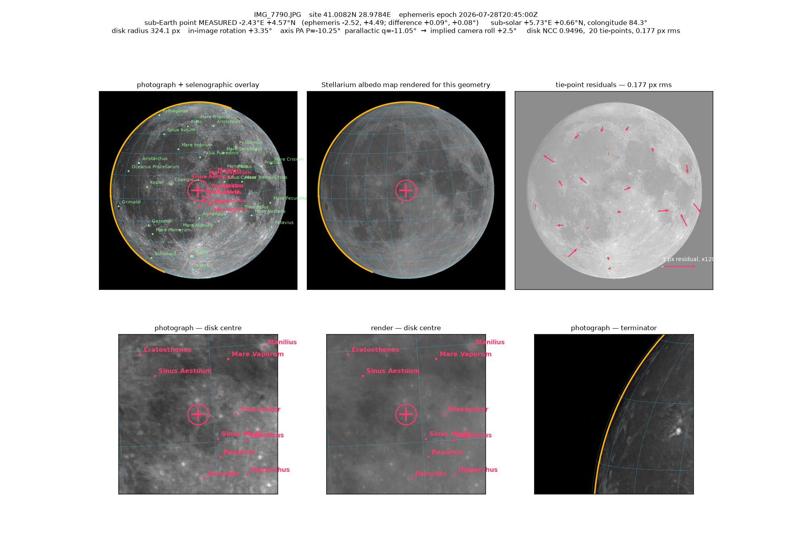

## A field test with a real instrument app: the terrain as an attitude reference

Four Theodolite frames from a moving car on the Asian side of Istanbul
(40.9412 N, 29.2119 E, ~177 m, 29 July 13:02:53–13:02:57 local, 8× zoom, looking
south across the Sea of Marmara). Each frame burns in its own GPS position,
altitude, true azimuth, roll and pitch, so the picture carries its own ground
truth. The car was doing ~82 km/h on a bearing of 210°, which moves the site 92 m
across the four frames and the distant ridge by under 0.06° — negligible.

**The site checks out.** SRTM against the app's own GPS altitude:

| frame | Theodolite | SRTM | diff |
|---|---|---|---|
| 13:02:53 | 176.8 m | 176.6 m | +0.2 m |
| 13:02:55 | 175.9 m | 175.6 m | +0.3 m |
| 13:02:56 | 173.7 m | 172.0 m | +1.7 m |
| 13:02:57 | 172.8 m | 169.8 m | +3.0 m |

**What is on that horizon.** Uludağ, 2524 m, 96.2 km away at azimuth 179.9°,
standing +1.02° above horizontal; in front of it the Samanlı ridge at 42–44 km,
600–850 m, +0.4 to +0.7°. The whole visible skyline is terrain 40–100 km off.

**The camera's field of view, solved from the terrain.** Fitting each frame
independently gave pixels-per-degree from 184 to 418 — the ridge is too smooth
over a narrow field to pin four parameters from one frame. The zoom did not
change between frames, so that one parameter is *shared*; the joint fit gives
**276 px/deg, a 9.5° horizontal field**, which matches an 8× zoom on the main
camera (≈200 mm equivalent) computed independently from the optics. Sharing the
parameter that is physically shared is what broke the degeneracy.

### Result 1 — the app's pitch is 1.5° out, and the terrain says so

With azimuth held inside the ±0.5° its whole-degree readout allows, and roll held
at the app's reading, the only freedom left is the elevation offset:

| frame | pitch readout | elevation from terrain | bias |
|---|---|---|---|
| 13:02:53 | −0.6° | +0.76° | **+1.36°** |
| 13:02:55 | −0.8° | +0.58° | **+1.38°** |
| 13:02:56 | −0.8° | +0.94° | **+1.74°** |
| 13:02:57 | −1.1° | +0.42° | **+1.52°** |

**Pitch bias +1.50° ± 0.17°** over four independent frames. On a celestial
altitude that is 90 arcminutes — **90 nautical miles** of position error, and it
would be invisible without an external reference.

Refraction cannot explain it: the curvature-and-refraction drop at 43 km is
0.17°, and hiding 1.5° would need an effective Earth radius of 736 km. The
candidates are an uncalibrated device-to-camera alignment (Theodolite ships a CAL
function for exactly this) or the optical axis not sitting at the centre of the
saved frame. **These four frames cannot separate those two** — both are constant
offsets — but they measure the total, which is what a navigator actually needs.

This is the study's core premise, measured rather than assumed: a phone's
synthetic horizon carries a bias of order a degree, and a known distant skyline
recovers it.

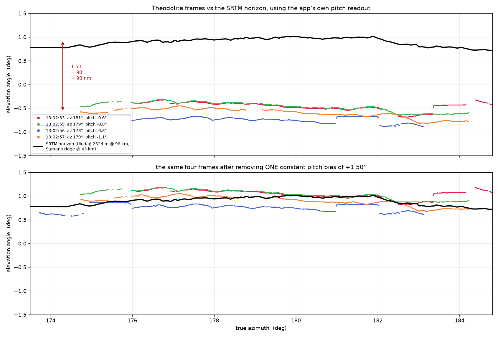

### Result 2 — but the position is NOT recoverable here, and the reason is general

Letting azimuth run free over a 100° search, the best match for the 13:02:56
frame is **197.7°** against a truth of 178.0° — **19.7° wrong**, and with a
*lower* residual (14.1 px) than the truth achieves. The fit is not broken; the
information is not there:

* an 8× zoom sees **9.5°** of azimuth;
* across that window the SRTM horizon has **0.52°** of relief, against **5.98°**
  available across the full 120° sector;
* the correlation between observed and predicted profile SHAPE is 0.49 and 0.60
  in two frames and 0.02 and −0.14 in the other two. Half the frames recognise no
  terrain pattern at all.

So the +1.50° bias above rests on the ridge's *height*, not on a pattern match —
an offset measurement, which is all that was claimed, but worth being explicit
about.

The general lesson contradicts the intuition that a longer lens helps. For
terrain resection **field of view beats angular resolution**: the earlier Bodrum
work succeeded on a wide panorama with kilometres of relief, and this fails on a
sharper picture of a flatter horizon. A narrow field is the wrong instrument no
matter how good the DEM is. Zoom in to measure an angle; zoom out to fix a
position.

## Can a photographed skyline fix your position?  A controlled test with real GPS

Three more Theodolite frames, from a fixed spot at 40.9046 N, 29.2094 E, 95 m,
looking SE across the Gulf of İzmit at azimuths 131°, 135° and 139° (13:07 local,
8× zoom).  Same self-documenting frames, so the GPS is ground truth and the
question can be asked properly: **inject a known error into the position prior,
search around the wrong prior, and measure how far the winner lands from the
truth.**

Site check again: SRTM 95.9 m against the app's 315 ft = 96.0 m.

The horizon here is the Samanlı range — 670 to 1310 m at 45 to 73 km, spanning
+0.15° to +0.92°.  Better than the earlier sector (0.77° of relief instead of
0.52°) and with genuine structure: one frame reaches a shape correlation of
**+0.89** against the DEM.

### The pitch bias is not a device constant — it depends on the platform

Re-running the earlier measurement on both sets:

| set | condition | pitch bias | frame-to-frame sd |
|---|---|---|---|
| 13:02 | moving car, ~82 km/h | **+1.505°** | 0.187° |
| 13:07 | standing at a fence | **+0.866°** | 0.052° |

The bias differs by 0.64° and the scatter is **3.6× smaller** at rest.  A 0.64°
tilt of the apparent vertical is an acceleration of 0.11 m/s², which is a very
gentle throttle change — so this is consistent with the accelerometer horizon
being pulled by platform acceleration, the effect this whole study exists to
bound.  Consistent, not proven: the two sets are at different sites and different
bearings, so a bearing-dependent error would look the same.

### The answer on this data: no

| GPS error injected | search box | recovered error, mean of 8 directions | worst |
|---|---|---|---|
| 0 km | ±1 km | 0.5 km | 0.5 km |
| 0.5 km | ±1 km | 0.5 km | 0.5 km |
| 1 km | ±1.5 km | 0.5 km | 0.5 km |
| 2 km | ±3 km | 2.1 km | 3.0 km |
| 5 km | ±7.5 km | 6.6 km | 15.2 km |
| 10 km | ±15 km | **16.0 km** | 23.7 km |

At small prior errors the "recovery" is the search box doing the work, not the
skyline.  From 2 km outward it is no better than the prior, and by 10 km it is
worse than doing nothing.  Over a ±20 km box the global best sits **14.6 km from
the truth with rms 0.097° against the truth's 0.142°** — a false minimum that
genuinely scores better.

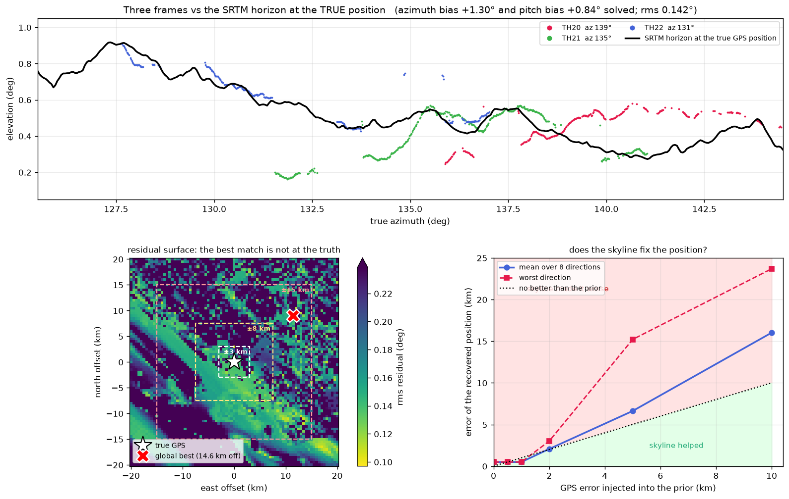

### Why — and what it would take

The two nuisance parameters absorb precisely the two first-order signals a
position shift produces.  Moving *across* the line of sight swings every feature's
bearing by nearly the same amount, which is indistinguishable from a compass
bias; moving *along* it raises the whole horizon together, which is
indistinguishable from a pitch bias.  Only the near-far **difference** survives:

| motion | raw signal | after the bias absorbs the common part | precision at 0.14° |
|---|---|---|---|
| lateral (across sight line) | 1.17 °/km at 49 km | **0.371 °/km** | 0.4 km |
| radial (along sight line) | 0.023 °/km at 49 km | **0.0073 °/km** | 19 km |

So the geometry is a **line of position, not a fix** — an error ellipse roughly
50× longer along the sight line than across it.  One bearing gives one LOP; this
is the terrestrial twin of needing two bodies for a celestial fix.

But even the 0.4 km lateral figure is not realised, and that is the instructive
part.  With 839 samples and *white* 0.14° noise, lateral position would come out
to ~15 m.  It comes out to nothing, because the 0.14° residual is **systematic** —
smooth in azimuth, correlated across every sample in a frame (extraction bias,
haze-dependent edge placement, DEM error, and a pitch bias that itself varies
0.05° between frames).  Correlated error is exactly what a position shift looks
like, so it does not average down; the effective sample count is the number of
FRAMES, not the number of pixels.

Confirming which constraint binds: repeating the whole search with the pitch bias
**fixed** at its calibrated +0.866° — which should sharply constrain range — still
puts the global minimum 16.6 km from the truth.  Calibration is not the
bottleneck.  **Skyline-match accuracy is.**

To make terrain resection work from a viewpoint like this, in order of leverage:

1. **Two well-separated bearings**, not one sector — crossing two lines of
   position is what turns an LOP into a fix.
2. **Wide field, not long lens** — 1× over 90° beats 8× over 9°, as the previous
   section also found.
3. **Push the systematic floor below ~0.03°**, which is what the 1 km-class radial
   sensitivity demands.  More pixels do not help until the errors are independent.

## Denver: a blind solve, and the near/far pair that makes it work

A stock photograph of the Denver skyline with the Front Range behind it — no GPS,
no bearing, no focal length, no EXIF beyond the copyright block.  Everything is
solved from the pixels and SRTM.  (The image is © Getty Images/iStockphoto and is
not redistributed here; only the extracted curves are.)

**The extraction is the easy part for once.**  The Turkish frames needed the red
channel because hazed ridges are ~30 DN darker than the sky there.  Here that
fails in both directions at once: the snowfields are *brighter* than the sky
(R 250 vs 175) and the hazed foothills are *bluer* (B−R 123 vs 68).  Modelling
the sky per column as a linear colour ramp and flagging departure in ANY
direction gets **1024 of 1024 columns**.

**The result.**

| | |
|---|---|
| position | **39.644 N, 104.878 W** (best point on the line of position) |
| azimuth of frame centre | 316.8° |
| field of view | 5.4° — about a 400 mm lens |
| skyline residual | **1.11 arcmin rms over 5.4° of horizon** |
| identification | the DEM puts the summit at image column 549 within **0.8 km of Longs Peak**, 92 km away — confirming the photo's own caption, which was read only afterwards |

1.11 arcmin is **7.6× better** than the 8.4 arcmin floor of the Turkish frames.
The Front Range gives sharp, individual summits instead of a smooth ridge, and
the residual has no visible azimuth-correlated structure left.

### The skyline alone still does not fix the position

Searching the whole metro area on the skyline alone puts the best cell at
39.670 N, 104.850 W — and that answer is **wrong**, decisively: from there the
DEM predicts downtown Denver 11.1° to the *left* of Longs Peak, while the
photograph shows it 1.25° to the *right*.  The same degeneracy as Istanbul; a
better residual did not cure it.

### What does fix it is a near object

The photograph contains one: **downtown Denver itself**, 15 km away, against
Longs Peak at 92 km.  The angle between Republic Plaza and the Longs summit is
1.39°, measured straight off the image, and it is enormously sensitive — roughly
**8° per kilometre** of lateral movement, because the near object is 6× closer
than the far one.  That single angle is a classic horizontal-angle **circle of
position**, the same construction as `landfall.two_landmark_circle_fix`.

It collapses the metro-wide ambiguity to an **11 km arc** running from
39.61 N 104.84 W to 39.69 N 104.93 W, about 0.2 km wide.  Along that arc the
skyline residual varies only from 1.11 to 1.19 arcmin — flat — so the arc is
where the answer stops.

**One angle, one line of position.**  A second identified near landmark at a
different bearing would cross it and give a true fix, and the machinery for that
already exists in `landfall.py`.  This is the same conclusion the Istanbul frames
reached from the other direction: there, the absence of a near/far pair was the
diagnosis; here, its presence is the cure, and the arc it leaves behind is
exactly the residual freedom the geometry predicts.

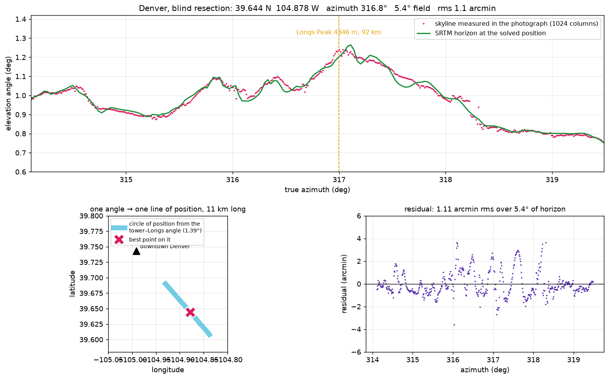

## What the field data changed in the code

Five photographs from three places produced findings that were worth more than
the fixes they prompted, so both are recorded here and both are now covered by
tests.

### The observability question now has an answer that costs a second

Both terrain-resection failures were predictable from geometry, and both cost
hours of grid search to discover instead.  `resection_geometry` makes the
prediction directly, and reproduces what was measured:

| scene | predicted ellipse | measured |
|---|---|---|
| Istanbul, ridges 50–53 km, 0.14° match | 2.4 km × 17 km — *not usable* | search no better than the prior beyond 2 km |
| Denver, terrain only, 0.019° match | 0.49 km × 15 km — *line of position* | arc ~0.2 km × 11 km |
| Denver, **plus one tower at 15 km** | 0.01 km × 3.3 km | the tower is what solved it |

The mechanism it encodes: a free compass bias eats the common bearing shift a
lateral move produces, and a free pitch bias eats the common elevation shift a
radial move produces.  Only the near–far **difference** survives.  So the number
that decides a viewpoint is the **range spread** of what you can identify — not
sharpness, not pixel count, not DEM quality.  At Istanbul the spread was 50–53 km
and the lateral leverage collapsed from 1.14 to 0.058 °/km, a factor of 20.
Adding one near object at Denver moved it from 0.039 to 3.3 °/km, a factor of 85.

`tools/scout_viewpoint.py` puts this in front of a shoot, with `--near` for
towers and masts the DEM does not contain.

### One extractor, and three silent failures it now cannot repeat

Each of these destroyed a run while looking like an absence of signal:

1. **Zero-padded smoothing.** `np.convolve(mode='same')` pads with zeros, so the
   first smoothed samples of every column dive toward zero and mimic a skyline
   edge at index 0 — which the "not at the very top" guard then rejects,
   discarding the whole column.  Two of 840 columns survived.  `smooth_columns`
   edge-replicates.
2. **Over-aggressive masking.** Excluding every column carrying overlay furniture
   left two disjoint 1.5° windows, and over 1.5° a distant ridge is a straight
   line — so the azimuth fit had nothing to bite on and ran to its search
   boundary.  Reject only what is opaque, found in the data.
3. **Panel edges read as ridges.** Same sign, comparable contrast; only the shape
   differs, because a panel returns the identical sub-pixel row for hundreds of
   columns.  Left in, those runs are long, smooth and confident enough that least
   squares weights them heavily.

And the scene-dependence itself: red channel for hazed ridges (30 DN of contrast
against 8 in blue), a sky-colour model where snow is *brighter* than the sky and
haze *bluer* — a case that defeats any single-channel threshold in both
directions at once.

### Correlated residuals, and why more pixels stop helping

`effective_samples` estimates the integrated autocorrelation of a residual
series.  On the Istanbul frames, 839 samples at 0.14° would have given ~15 m of
lateral position if the noise were white.  It gave nothing, because the residual
is smooth in azimuth — extraction bias, haze-dependent edge placement, DEM error,
a pitch bias drifting 0.05° between frames — and correlated error is exactly what
a position shift looks like.  The effective count was of order the number of
**frames**, not of pixels.  Any uncertainty quoted from a dense skyline match
should be inflated by `sigma_inflation` before it is believed.

### Two API decisions taken because of near-misses

* `sensitivity(features, eye_m)` makes the observer height **positional and
  required**.  Defaulting it to zero computes every elevation as if from sea
  level, overstating the radial sensitivity twentyfold for a hilltop — and
  returning a number that still looks plausible.
* `circle_of_position` solves the locus **numerically and verifies every point**.
  The textbook inscribed-angle circle is a planar theorem; across a 78 km chord
  it disagrees with spherical bearings by ~0.3°, which at 3 °/km is a 100 m bias,
  and the constructed arc runs through one of the landmarks where the bearing
  degenerates.  Branch-picking by hand is the same class of sign reasoning that
  has failed three separate times in this project, so it is no longer done by
  hand.

## Closing the loop: the biases belong in the graph, not in the sigmas

The field measurements left one gap — `effective_samples` could say how much to
inflate an uncertainty, but nothing fed that into the terrain factors, so
`solve_landmark_fix` still reported covariances that flattered themselves.

The fix turned out not to be inflation at all. A compass error is COMMON to every
bearing taken at one moment and a pitch error common to every elevation; smearing
them into per-measurement sigmas both over-counts the noise and lets the fit
pretend the errors average down. So `landmark_bearing_factor` and
`landmark_elevation_factor` now optionally take a `bias_key`, and
`solve_landmark_fix` grows `compass_bias_sigma_deg` / `pitch_bias_sigma_deg`,
which make each bias a shared, estimated variable with a prior of that width.

**What that is worth, on the biases this study actually measured:**

| injected error | bias not modelled | bias as a graph variable | recovered |
|---|---|---|---|
| compass +1.5° (ordinary phone magnetometer) | **12.4 km** off | **2 m** off | +1.499° |
| pitch +0.9° (measured, standing at a fence) | **9.6 km** off | **2 m** off | +0.900° |

A degree and a half of heading error does not widen a terrain fix — it *moves*
it by twelve kilometres, because a common bearing offset is precisely what a
lateral position shift looks like. The +1.50° pitch bias measured from a moving
car and the +0.87° measured standing still are both large enough to do the same.

**And the covariance now reads honestly.** With the biases estimated, the
reported ellipse shows the line-of-position elongation instead of hiding it, and
adding one landmark at 15 km to a set otherwise at 89–93 km collapses the
across-track axis by more than 5× — the same conclusion `resection_geometry`
reaches from geometry alone, now arrived at independently through GTSAM's own
marginals.

Where the two disagree is instructive rather than troubling: `position_dilution`
credits only the near–far *difference* and so is deliberately conservative on the
along-track axis, while the graph fuses bearings and elevations together and does
better. They agree on the verdict, on the elongation, and on the across-track
axis, which are the parts that decide whether a viewpoint is usable.

`calibrated_sigma_deg` supplies the remaining piece: the per-observation sigma
inflated by sqrt(n / n_eff), for the correlated residual that survives after the
common mode has been taken out.

## Lake Tahoe from a laptop screen: a null result, and the parameter that caused it

A photograph of a MacBook Pro displaying the stock Lake Tahoe wallpaper.  The
scene is unambiguous — rounded granite boulders in turquoise shallows, a lone
Jeffrey pine on a rock point, a snow-covered range 15–30 km off across deep
water: the Nevada east shore looking west at the Sierra crest.  Rough position
taken as Sand Harbor, 39.198 N 119.931 W, lake surface 1897 m.

**Two projections had to be separated first.**  The wallpaper is already a
perspective image; photographing the laptop off-axis applies a second, unrelated
homography on top.  Fitting lines to the four display edges and intersecting them
gave a **4.9% horizontal keystone**, which uncorrected stretches the azimuth
scale by 4.9% across the frame — 0.9° on a 19° field, kilometres of position at
20 km.  The bezel is a known rectangle, so that one comes out exactly.

Extraction then went cleanly: **1800 columns** of crest, once the threshold was
raised to 45 (the real snow/rock edge gives ~90 units of colour departure; the
sky's own nonlinear gradient gives ~14, and at the default the left half of the
frame locked onto the gradient instead of the mountains).

**And the search failed.**  Top ten fits after a two-stage search over the whole
shoreline:

| rms | position | azimuth | field |
|---|---|---|---|
| 2.09′ | 39.345 N 120.070 W | 247° | 15.2° |
| 2.13′ | 39.228 N 120.070 W | 300° | 15.2° |
| 2.16′ | 39.074 N 120.149 W | 254° | 15.2° |
| 2.19′ | 39.345 N 120.072 W | 294° | 16.4° |

Positions scattered over ~30 km of shore, azimuths from 247° to 313°, residuals
all within 0.25′ of each other, and the fitted scale pinned against its bound in
almost every row.  That is not a fix with poor precision; it is no fix at all.

### The cause: an unknown focal length is a *third* nuisance parameter

`resection_geometry` knew about two — a compass bias absorbing lateral motion,
a pitch bias absorbing radial motion.  This image has a third and worse one.  The
wallpaper is a **crop of unknown extent**, so the pixels-per-degree is unknown,
and every measured angle therefore carries an unknown common scale.

Moving the camera toward the terrain scales all apparent angles up together —
which is *precisely* what shortening the focal length does.  The two are
degenerate to first order.  Demonstrated directly by moving the camera along the
sight line and refitting:

| camera moved | rms | fitted scale |
|---|---|---|
| 0 km | 2.04′ | 298 px/deg |
| 4 km | 1.92′ | 298 px/deg |
| **8 km** | **1.92′** | 298 px/deg |

Eight kilometres, 0.1 arcmin.  The range information is not degraded, it is
absent.

`focal_absorbed_radial` and `position_dilution(..., focal_free=True)` now
quantify it.  On this scene:

| | across | along |
|---|---|---|
| focal length known | 0.03 km | 0.56 km |
| focal length unknown | 0.03 km | **2.92 km** |

and the real search is worse still, because the residual floor here is dominated
by systematics (a screen photograph carries moiré, the LCD's own pixel grid and
an off-axis colour cast) rather than by the geometry.

**The lesson generalises beyond wallpapers.**  Any image without EXIF — a crop, a
screenshot, a frame lifted from video, a stock photograph — has lost its scale,
and with it most of its range information.  Lateral position survives; radial
position does not.  Denver worked despite being a stock photograph only because
the *near* landmark supplied an angle that a common scale cannot fake.  Tahoe
had no near landmark, and nothing to replace it.

## The same scene from the original file: what a null result was actually hiding

The previous section blamed the failure on an unknown focal length, and that was
right as far as it went.  It was not the whole story, and the way to find out was
to remove the *other* handicap: stop photographing a laptop and use the file.

**Finding it.** The wallpaper is `26-Tahoe-Beach-Day.png`, **6016 × 3384**,
mirrored in a public GitHub wallpaper archive.  **There is no EXIF.**  512 Pixels
re-exports these as PNG, which strips the maker note, the focal length and
everything else — so the scale stayed unknown and the third nuisance parameter
stayed in force.  What the original does supply is *geometry*:

| | screen photo | original file |
|---|---|---|
| usable crest columns | 1 800 | **5 070** |
| vertical relief of the crest | 72 px | **129 px** |
| horizontal field | 19° | **42°** |
| extra projections to undo | keystone, moiré, LCD grid | none |

macOS displays this wallpaper cropped; the photograph of the screen therefore
captured about a third of the frame's azimuth span.  Shape, not sharpness, is
what a resection reads, and two thirds of the shape had simply been missing.

**It still failed with the scale free.**  Searching *f* over 60–520 px/deg pinned
it at 510 and returned scattered positions at 2.2–2.7′ — the same non-fix as
before, on three times the data.  A free scale is not a wide prior; it is a
licence to rail.

**Bounding the scale physically fixed it.**  The extraction has already measured
the relief — 129 px of crest, once the near rock point is masked — and the DEM
says how many degrees that can be.  The binding side is the *upper* bound on *f*,
because railing to 510 is the failure: `f_hi = relief_px / (smallest angular
relief any candidate shows)`.  Rendered over the 42° arc, no position in the
basin subtends less than **0.84°**, so with a 25% margin *f* ≤ **205 px/deg**.
The run reported here used a hand-set 100–176, so the obvious objection is that
the bracket was drawn knowing the answer.  It was not: rendering all 140
candidates and letting `focal_bounds_from_relief` do it blind gives **5–205
px/deg** — a 40-fold span, with a lower bound 30× below the solution — and the
search *still* converges, to 39.2250 N 120.0100 W, 0.28 km from the hand-tuned
answer, separation 2.24× against 2.90×.  Only the upper bound ever binds.  The
same search then converged:

| rms | position | ground | azimuth | field | roll |
|---|---|---|---|---|---|
| **2.12′** | **39.2230 N 120.0080 W** | 1899 m | 220.2° | 42.1° | +0.06° |
| 2.14′ | 39.2250 N 120.0100 W | 1920 m | 219.6° | 41.8° | +0.03° |
| 2.20′ | 39.2250 N 120.0080 W | 1925 m | 219.8° | 41.5° | +0.02° |
| 2.28′ | 39.2270 N 120.0120 W | 1921 m | 219.0° | 41.2° | +0.02° |

Every row within **600 m**, azimuth within 1.2°, and the roll comes out at
+0.06° without ever being forced — the level horizon a landscape photograph
should have, which the failed search had to buy at −3.3°.

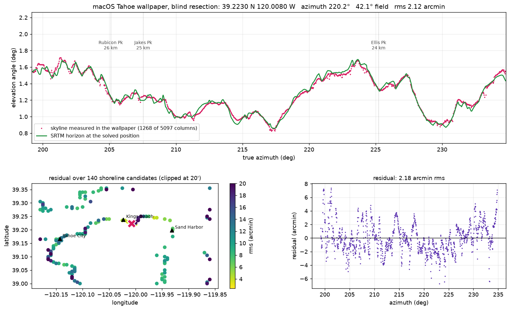

**That it is a minimum, not a preference.**  A winning residual proves nothing on
its own; separation does.  Across the 140 shoreline candidates the median is
**10.29′** and the worst 68′, and *nothing further than 10 km away scores better
than 7.23′* — a factor of 3.4 between the answer and the whole rest of the lake.
The failed screen-photo search had its top eight inside 0.4′ of each other and
scattered over 30 km.

**Where it is.**  39.2230 N 120.0080 W is the tip of **Stateline Point**, at the
California–Nevada line between Crystal Bay and Agate Bay, looking **south-west
down the length of the lake**.  The DEM neighbourhood confirms it is genuine
land, not a spike: a ridge running up to 2174 m to the north, water at 1898 m to
the south, east and west.  On that skyline it puts **Rubicon Peak at 26 km,
Jakes Peak at 25 km and Ellis Peak at 24 km**.

This corrects the earlier reading.  The screen-photo section called the scene
"the Nevada east shore looking west" and used Sand Harbor as the rough position.
It is the **north** shore looking south-west, 7.4 km away — and Sand Harbor
scores 6.73′, three times worse than the answer.  The rough position was wrong,
and the wide frame is what exposed it.

### The honest uncertainty is not the one the sample count suggests

1 268 samples at 2.18′ rms would be 0.06′ on the mean if the residual were white.
It is not: the integrated autocorrelation gives **n_eff = 33**, a **6.2×**
inflation, so the honest figure is **0.38′**.  The residual panel shows why —
smooth excursions tens of degrees wide, which is exactly what a position shift
looks like.  Combined with the ~600 m spread of the top fits, the defensible
claim is **≈1 km, 1σ** — not the 100 m the raw residual would flatter.

### What this changes in the code

`resection_geometry.focal_bounds_from_relief(relief_px, terrain_reliefs_deg)`
turns the measured pixel relief and a DEM-derived angular relief into an *f*
bracket, with the inversion (more degrees for the same pixels ⇒ shorter focal
length) and the foreground-masking caveat written down where they can be tested
rather than rediscovered.  Masking matters: unmasked, the near rock point and its
pine take the relief from 129 px to 242 px and drive the bracket low, which
pushes the solved position outward.

### Which change did it: the frame, or the bound?

Two things changed at once — a 19° crop became a 42° frame, and the scale gained
a bound.  Reporting both and claiming the win would not say which mattered, so
run the 2×2 on the *same* extraction, scored on **separation** (best candidate
more than 10 km from the winner, divided by the winner) rather than on the
winning residual:

| | scale free, 60–520 | scale bounded, 100–176 |
|---|---|---|
| **narrow 19°** (2 717 cols) | 1.34′, *f* railed at 516, **1.17×** | 1.79′, *f* 144, **2.37×** |
| **wide 42°** (5 065 cols) | 2.20′, *f* railed at 516, **1.04×** | 2.50′, *f* 144, **2.90×** |

**The bound is what does the work.**  Both bounded cells land within **0.3 km** of
the converged answer; both free cells rail the scale and separate by essentially
nothing — and the wide free cell puts its best fit **14.4 km** away, so more data
with an unconstrained nuisance parameter made it *worse*, not better.  Width is
worth a further 2.37 → 2.90 in separation: real, and secondary.

Note that the residual column runs backwards.  The free-scale searches fit
**better** (1.34′ against 1.79′) while localising worse.  That is exactly what an
unconstrained nuisance parameter buys — residual, not position — and it is why a
winning rms must never be reported as evidence of a fix without the separation
beside it.

**This corrects the framing above.**  The crop was not the primary cause of the
screen photo's failure; the free scale was.  Restricted to the same central 19°,
this extraction still fixes the position to 0.3 km once *f* is bounded.  The crop
cost precision and separation — it did not cost the fix.  What the screen photo
added on top was its own systematics (keystone, moiré, the LCD's pixel grid) and
a search allowed to rail.

**The revised lesson.**  An unknown scale is not the same as an unconstrained
one.  `focal_absorbed_radial` is right that radial position is degenerate with
focal length *to first order*; the mistake was letting that justify an
unrestricted search.  The degeneracy is first-order, and a physically bounded
scale leaves enough second-order signal to localise even a 19° field.  Denver
needed a near landmark not because its field was 5.4° as such, but because
nothing there bounded the scale independently — the near tower did that job.

### The positional error, measured against known truth

Everything above — 2.12′ rms, a 600 m spread of top fits, 2.90× separation — is
*internal to the fit*, and a fit can be tight and wrong.  For the wallpaper there
is no ground truth to difference against: Apple does not publish the location and
the file has no EXIF.  So run the identical search where truth **is** known:
synthesise the observation from the DEM at six known shoreline points, corrupt it
with the error actually measured on the wallpaper — 2.18′ rms at **n_eff = 33**,
generated correlated, because white noise at that level would be trivially
beatable and would not mimic a position shift — and difference recovered against
true.

| truth | recovered | error | rms | separation |
|---|---|---|---|---|
| 39.2250 −120.0100 | 39.2250 −120.0100 | **0.00 km** | 2.98′ | 2.49× |
| 39.2350 −120.0200 | 39.2350 −120.0200 | **0.00 km** | 3.19′ | 2.22× |
| 39.2400 −119.9650 | 39.2450 −119.9650 | 0.56 km | 3.03′ | 2.53× |
| 39.1950 −119.9300 | 39.2050 −119.9300 | 1.11 km | 2.78′ | 2.15× |
| 39.1650 −120.1450 | 39.1650 −120.1450 | **0.00 km** | 3.16′ | 2.52× |
| 39.0750 −120.1500 | 39.0750 −120.1500 | **0.00 km** | 2.39′ | 3.65× |

Median 0.00 km, mean **0.28 km**, worst **1.11 km** — four of six land in the
correct cell, the other two one and two grid steps out.

**Read it as a floor, not as the answer.**  Three things flatter it:

1. **DEM error cancels exactly.**  The same DEM generates the observation and
   scores the candidates, so SRTM's own error contributes nothing.  In the real
   solve it contributes a great deal: 10 m of height error at 25 km subtends
   **1.4′**, and 16 m subtends 2.2′ — the same order as the entire measured
   residual.  The wallpaper fit is essentially at the DEM noise floor, and that
   error is spatially correlated, which is the most likely origin of n_eff = 33.
2. **The truth points sit on the search grid**, so a perfect search scores exactly
   zero and the 500 m cell size cannot show up as error.
3. **The noise is zero-mean and stationary.**  A real systematic — an uncorrected
   pitch bias, a scale error, snow or canopy raising a crest — shifts position
   coherently and is not represented.

**What it does establish** is the discriminating power.  Separation across the
six correct solves runs **2.15–3.65×**; the wallpaper's own fit sits at 2.90×,
inside that band, while the degenerate free-scale searches sat at 1.04–1.17×.
Without ground truth that is the strongest available statement about the Tahoe
answer: its separation is characteristic of a solve that has found the right
place, not of one that has not.  The **≈1 km** claim stands — supported now by
more than the internal spread of the fit, and still not to be confused with a
measured error.

## Waterline to summit: the observable that was in the frame all along

The far waterline's own depression is a poor rangefinder — its entire signal is
the curvature drop, worth 0.20′/km on the far branch, so the wallpaper's 2.18′
residual buys about 11 km.  Measuring instead from the **waterline at a
mountain's foot up to its summit** changes the lever from the curvature of the
earth to the height of the mountain, and that is a different instrument:

| peak | range | above lake | extent | sensitivity | range error at 2.18′ |
|---|---|---|---|---|---|
| Rubicon Pk | 26.3 km | 917 m | 2.00° | **4.55′/km** | **0.48 km** |
| Jakes Pk | 25.0 km | 858 m | 1.96° | 4.71′/km | 0.46 km |
| Ellis Pk | 23.8 km | 748 m | 1.80° | 4.55′/km | 0.48 km |
| *bare waterline, far branch* | | | | *0.20′/km* | *10.9 km* |

**23× better** — but the size of the signal is not the point.  What matters is
what *cancels*, because both angles are read in one image at one azimuth:

- **eye height** enters as `(H−E)/d − (L−E)/d`, and *E* drops out;
- **pitch bias** is a common vertical offset, differenced away exactly;
- **curvature** is `−d_s/2R + d_w/2R`, zero when foot and summit share a range;
- **refraction** is very nearly the same air path, so mostly common-mode.

The pitch cancellation is the valuable one.  A free vertical offset is precisely
what absorbs radial position in a skyline fit — it is nuisance parameter number
two — and this observable is blind to it.  The focal length does *not* cancel,
since the extent is still measured in pixels.  *(An earlier version of this
section claimed three or more summits then determine position and scale together.
That is wrong on this scene — see the correction below.)*

**The setback is the only thing that genuinely breaks it**, and it is forgiving.
The residual term is `setback/(2 R_eff)`:

| summit set back from the shore | extent changes by | range bias |
|---|---|---|
| 1 km | −0.23′ | 0.05 km |
| 2 km | −0.45′ | 0.10 km |
| 8 km | −1.79′ | 0.39 km |

Even 8 km of setback stays below the noise on a real photograph.

### Tested out-of-sample on the wallpaper

The resection was fitted to the **crest only**.  The far shoreline — the west
shore meeting the lake at 20 km — was never used, so its predicted row is a
genuine prediction rather than a fit.

| | |
|---|---|
| predicted row, from the crest solve | 1691 |
| measured row, red-channel water edge | 1696 |
| **out-of-sample residual** | **+1.93′ mean, 5.10′ rms over 141 columns** |
| as a range error at 4.55′/km | **0.42 km** |

Five pixels out of 3384.  This is the strongest independent evidence the Tahoe
position is right: nothing about the far shore entered the search, and the solve
places it correctly.

**Two extraction traps, both worth recording.**  *Blueness* is the intuitive
discriminator for water and it is wrong here — atmospheric haze makes the distant
range as blue as the lake (both at `b−(r+g)/2` of 55–65), so a blueness edge
lands 135 px high, on a snow line.  **Red** separates cleanly and for a physical
reason: deep water absorbs red almost completely (5–30 here) while rock, snow and
forest all reflect it (50–210).  And going down the frame the order is mountain
foot, far waterline, open lake, boulders, nearer lake — so the **first** water
below the range is the far shore.  Taking the lowest water run instead latches
onto water beyond the foreground boulders, which put the first attempt 17′ low.

### Dropping the waterline prior: it was never load-bearing

Every Tahoe solve above leaned on one sentence of image reading — the boulders
stand in ankle-deep water, so the camera is at the lake surface — which turned a
two-dimensional search over the basin into a one-dimensional ring of 140
candidates.  That is a prior, and it was never priced.  So drop it: search **all
2 640 land cells** in the same box, ground height from the DEM at each.

| | shoreline ring (140 cells) | all land (2 640 cells) |
|---|---|---|
| winner | 39.2230 −120.0080 | 39.2250 −120.0100 |
| distance between them | — | **0.28 km** |
| separation | 2.90× | 2.37× |
| median residual | 10.29′ | 10.19′ |

Cells within 600 m of the constrained answer come back at **ranks 0, 1 and 2 of
2 639**.  Nineteen times the search space, and the same place wins.

**So the waterline prior bought speed, not the fix.**  This corrects the framing
used while setting the search up, where it was described as the constraint that
made the problem tractable at all.  It made it 19× cheaper.

Note that an unknown eye height was never what was being tested: the constant
term of the fit is a free vertical offset, so height was always absorbed.  What
this drops is the *candidate restriction*, and the shape of a 42° skyline turns
out to be specific enough not to need it.

**The real cost of losing the waterline is the observable, not the prior.**
Without it there is no waterline-to-summit extent, and with it goes a 0.48 km
rangefinder that is immune to pitch bias — the 0.29 km radial axis in the table
above collapses back into the focal-length degeneracy.  Those are two different
losses and only the second one matters:

| what is lost | cost |
|---|---|
| waterline as a **position prior** | 0.28 km, separation 2.90 → 2.37, 19× more compute |
| waterline as an **observable** | the radial axis: 0.29 km → focal-degenerate |
| sea horizon as an **attitude reference** (celestial) | 13× standalone at sea, 2× inside the fusion |

**The pattern across all three.**  Waterline-to-summit is the terrain analogue of
the ultrawide optical horizon, and both are the same trick as Δq(Sun−Moon) in the
factor graph: difference two features *within one frame* so the platform's
attitude error cancels, rather than measure any one angle better.  Every absolute
angle in this study has a nuisance parameter sitting on it; the fixes come from
differences.

### Correction: the waterline does not replace the focal bound

The section above priced the waterline-to-summit observable and validated it
out-of-sample, then claimed ranges to three summits "determine position **and**
scale together".  Pricing is a Fisher calculation and assumes the model; it is
not evidence.  Putting the observable into the objective and re-solving with the
scale free shows the claim is wrong on this scene.

Same 140 candidates, *f* free over 60–520 in both runs:

| objective | best | position | *f* | from the bounded answer | separation |
|---|---|---|---|---|---|
| crest only | 2.69′ | 39.1350 −120.1550 | **railed 516** | 16.01 km | **1.00×** |
| crest **+ waterline** | 2.77′ | 39.3550 −120.0550 | **railed 516** | 15.22 km | **1.28×** |

It helped, and visibly: separation went from 1.00× to 1.28×, and the correct
place now appears at ranks 2 and 3 with *f* = 148 and 140, against the bounded
solve's 143 — it had appeared nowhere at all before.  But it did not win, and
the scale still railed.

**Why, and it is not a bug.**  The extent is `f·ΔH/d`, so each summit measures
the **ratio** *f/d*, never *d* itself.  Recovering position and scale together
therefore needs summits spanning a wide range of **distances**, not merely of
bearings — and a lake basin does not provide that.  The three Tahoe peaks lie
between 23.8 and 26.3 km, an **11% spread**, across 20° of bearing:

| | σ across | σ along | σ_f | condition number |
|---|---|---|---|---|
| focal length **known** | 1.77 km | **0.28 km** | — | well posed |
| focal length **unknown** | 13.2 km | 5.6 km | **55%** | **1.7 × 10⁶** |

So the honest summary of what the waterline is worth:

- **With the scale known or bounded** — a real gain: 0.28 km radially, and an
  observable immune to the pitch bias, confirmed by the 1.93′ out-of-sample
  prediction of the far shoreline.
- **With the scale free** — it is *not* a substitute for
  `focal_bounds_from_relief`.  The two are complementary, and the bound is still
  what makes the search converge.

The general form of the lesson, which is the third time this study has met it:
an observable that measures a *ratio* cannot break the degeneracy between the
two things whose ratio it measures.  The near tower at Denver worked because it
was 15 km against 92 — a 6× spread in range.  Tahoe's peaks are all the same
distance away, so they all say the same thing.

## A panning video: the scale comes free, the vertical does not

An 18.6 s portrait clip (720×1280, 30 fps) panning 93° across a Bodrum bay at
dusk — the same scene as the earlier still, and the first moving-camera input in
this study.

### What the video gave: its own focal length, to 0.4%

The file is transcoded (`mp42`, no Apple keys, no creation time) so the focal
length was gone again — the third nuisance parameter, in force for the third
scene running.  But a **pan measures its own scale**.  Under pure rotation
`x = f·tan θ`, so a rotation `dψ` moves a point by `dψ·(f + x²/f)`: the frame
edges sweep faster than the centre by `1 + (x/f)²`.  Tracking the skyline in five
windows across 482 frame pairs gives that curvature as **+1.13%** edge-vs-centre
(bootstrap 98% positive), hence

| | f | horizontal field | vs measured |
|---|---|---|---|
| **measured from the pan** | **3381 ± 910 px** | 12.16° | — |
| 4× (100 mm equiv) | 3394 px | 12.11° | **0.4% off, 0.0σ** |
| 8× (200 mm equiv) | 6789 px | 6.07° | 100.8% off, **3.7σ** |

Confirmed independently: the camera was on 4×.  **So Tahoe's unknown scale was
never fundamental — it was an artifact of using a single frame.**

*This is not a new method.*  It is a special case of Hartley's self-calibration
from a rotating camera (ECCV 1994), and the fact that **single-axis rotation is a
recognised critical motion** — focal length recoverable, full calibration not —
was in the literature before I re-derived it.  See `related_work.md`.

### Stitching: a random walk, and how the redundancy kills it

559 frames → one azimuth/elevation curve over 104°.  Chaining 558 pairwise
alignments is a random walk: at ~0.5 px per step, √558 × 0.5 ≈ 12′, and the
chained stitch duly sat at **16.3′**.  The pan never revisits an azimuth, so there
is no loop closure.  But a 12° field sweeping 93° means **every azimuth is seen by
~70 frames**, so solving each frame's yaw and pitch against the global curve
turns the walk into an average:

| iteration | 0 | 1 | 2 | 3 | 4 | 5 |
|---|---|---|---|---|---|---|
| repeatability | 16.33′ | 8.31′ | 3.76′ | 2.45′ | 1.52′ | **1.15′** |

### And the position solve failed — twice

| objective | best rms | separation |
|---|---|---|
| full stitched curve | 37.80′ | **1.06×** |
| high-passed at the field of view | 21.52′ | **1.00×** |

A 33× gap between how well the observation *repeats* (1.15′) and how well
anything *fits* it (37.8′) means the observation is corrupted, not noisy.

**The cause: a pan cannot recover elevation structure longer than its own field
of view.**  A slow camera pitch drift and a slow terrain trend are the same
function of azimuth, and with a 12° window the bundle adjustment absorbs
everything longer into per-frame pitch.  Measured: the fitted pitch retains
**1.08° of std after smoothing over 6° of yaw**, and of the stitched curve's 66′
total variance only **28′** lies at wavelengths shorter than one frame.  Over
half the signal is in a band the pan cannot vouch for — and that is the band a
104° resection depends on.

The bundle adjustment that fixed the random walk achieved **self-consistency,
which is not correctness**: it made the frames agree by inventing a pitch
history.  Repeatability improved 14× while the answer stayed wrong, which is
worth remembering as a diagnostic — *repeatability is not accuracy*, and only the
separation metric caught it.

This is the free-focal-length lesson one axis over.  A pan self-calibrates
**scale**, because `sec²` curvature is a within-frame signature.  It cannot
self-calibrate **tilt**, because tilt has no within-frame signature at all.

### What the literature says to do instead

Reading rather than deriving (`related_work.md` has the sources and the caveat
that full texts were unreachable):

1. **Attitude from the horizon first, then position** (Grelsson & Felsberg; Dumble
   & Gibbens).  The sea horizon is plainly visible in this clip and was never
   used.  The pan cannot supply its own vertical; the horizon can.
2. **Match local curvelets, not a globally aligned curve** (Baatz, Saurer et al.,
   ECCV 2012).  A bag of *local* skyline descriptors is invariant to exactly the
   slow drift that destroyed this solve; my two-global-offset alignment is the
   estimator most vulnerable to it.
3. **Sample roll and tilt** rather than fitting them free — the published
   pipelines sweep roll over ±6° instead of letting an offset absorb it.
4. **Extract the skyline with continuity** (shortest-path / DP across columns),
   which is what the classical baselines do; the per-column decisions in
   `skyline_extract` mislocked onto rooflines and the waterline here.
5. **Judge against the field's 1 km criterion** — Baatz et al. report 88% of 200+
   images within 1 km.  By that standard the Tahoe result is *at* the state of the
   art, not a disappointment, and Bodrum is simply not solved.

### Correction: there is no sea horizon in that clip — and what to use instead

I proposed taking attitude from the horizon, citing the sea horizon as "plainly
visible" in the pan.  It is not there at all.  The bay is enclosed: in every
frame the water meets **land** — the opposite peninsula — never sky.  What looks
like a horizon is a *coastline*, whose depression depends on its range, which is
the weak and two-fold-ambiguous observable already characterised in
`waterline_range`.  So the published horizon-first recipe cannot be applied to
this clip as written.

The correction points somewhere better.  The **coastline** is the right feature,
for a reason that has nothing to do with attitude: it is the one thing in the
scene whose height is known *everywhere* (sea level), so its depression is a pure
function of range, and **crest minus coastline at the same azimuth is pitch-free**
because both are read in the same frame.  That cancels the drift that wrecked the
solve, whatever its azimuth dependence.

And this scene meets the condition Tahoe could not:

| | Tahoe peaks | Bodrum coastline across the sweep |
|---|---|---|
| range spread | 23.8–26.3 km, **11%** | 0.7–42.3 km, **60×** |
| depression range | — | 337′ (5.6°) |

The 11% spread is exactly why the Tahoe extents could not determine position and
scale together.  A 60× spread is a different problem.

**Blocked on extraction, not on geometry.**  The crest extracts cleanly (verified
by overlay on four frames across the pan).  The coastline does not: at dusk both
water and land sit near `r−b = −30`, and the mechanism that separates them —
distant land hazing warm to about −14 while water stays at about −40 — is too
weak and too variable.  Per-column thresholding gives 55% coverage that is
visibly wrong, scattering into open water and, in the last frame, jumping to the
ridge top.

Note the sign flip against Lake Tahoe, where water was the *red-dark* class.
Here water is the *bluer* class and the step runs the other way.  The cue is
scene-dependent; only the geometry is not.

This puts the continuity-constrained extractor (shortest path / dynamic
programming across columns, as the classical skyline literature does) on the
critical path rather than in the nice-to-have list: a smooth-and-continuous prior
is precisely what rejects the scattered mislocks that per-column thresholding
cannot.

### A continuity-constrained extractor — and the limit it exposes

`skyline_dp` replaces the per-column decision with a **minimum-cost continuous
path** across the columns: cost is how unlike a boundary each pixel is, plus a
penalty for moving vertically between neighbours, so a weak but coherent edge
beats a strong but isolated one.  This is the classical baseline the skyline
literature has always used and this project should have started from.

Validated on the Bodrum failure mode in miniature — a weak coherent boundary with
30% of columns carrying a much stronger spurious step:

| | median error | columns >15 px wrong |
|---|---|---|
| per-column (the old rule) | 5.0 px | **72 of 300** |
| `skyline_dp` | 3.0 px | **0** |

The path is a pixel or two less sharp and never jumps.  That is the right trade:
a boundary that leaps to a rooftop is not a slightly worse measurement, it is a
wrong one.

**But it did not extract the Bodrum coastline, and the reason is worth keeping.**
Continuity fixes *incoherent jumping*; it cannot manufacture a cue that is not
there, and this scene does not have one:

- **Blueness** puts the path 35 px below the crest instead of 300–500.  Going
  down the frame there are *two* upward steps in `b−r` — sky→land and land→water
  — and at dusk the first is the stronger, so the path latches onto the crest it
  was supposed to be measuring below.
- **Texture** is inconsistent in sign.  In the opening frame the *water* is the
  more textured class (1–7 against 0.2–0.7) because ripples beat a haze-smoothed
  distant hillside; 540 frames later the town saturates it at 10–19.

So the coastline observable — geometrically the strongest thing in this scene, a
known-height contour with a 60× range spread — remains unmeasured, blocked on
segmentation rather than on geometry or on estimation.  That is where the
learned-segmentation half of the skyline literature earns its keep, and it is the
honest next step rather than a third hand-tuned colour rule.

## Istanbul: a fully anchored frame, and what three frames reveal that one cannot

Three iPhone 17 Pro frames from the Kartal/Maltepe shore, 31 July 2026, taken
within 3.5 s of each other while panning across the Princes' Islands.  Every
parameter this study has ever had to fit is carried in EXIF:

| | |
|---|---|
| position | 40.906223 N, 29.139447 E (GPS), eye **2.5 m** above sea level |
| heading | `GPSImgDirection`, TRUE |
| pitch | Theodolite `vert_angle_deg` in `ImageDescription` |
| focal | `FocalLengthIn35mmFilm = 200`, `DigitalZoomRatio = 8.0` → **406.6 px/deg**, 9.89° field |

So nothing is searched.  The DEM prediction is a *prediction*, and the residual
measures the model rather than a fit.

### The match: 2.3 arcmin

Frame 067 (heading 244.35°) looks at **Burgazada — summit 159 m at 7.4 km**.  With
position, scale and attitude all given, the only freedoms are the two classical
nuisances, and after removing them the silhouette matches summit-to-shoulder:

| | |
|---|---|
| shape residual | **2.3′ rms** over 12° of island |
| target range | 6.6–7.4 km, heights 35–159 m |

That is the tightest terrain match in this study — Tahoe's 2.12′ came with a
*fitted* position, this one with a **given** one.

### Three real bugs, all found by this scene

1. **The DEM tiles are not pure SRTM.**  The AWS `elevation-tiles-prod` product
   is SRTM merged with **bathymetry** — N40E028 holds 4.1 M cells below −100 m,
   minimum −1308 m.  A camera sees the water *surface*, never the sea floor.
   `render_skyline(..., water_level_m=0.0)` now exists for this; the parameter
   takes a lake level too (1897.0 at Tahoe) and stays opt-in, because genuine
   below-datum land exists.

   **But it did not fix this scene, and saying so matters.**  Re-running frame
   065 through the committed function measured *zero* of 1100 azimuths where
   clamping changed the horizon: `render_skyline` takes the **max** angle along
   each ray, and a −900 m sea floor never wins a max.  The clamp is right in
   principle and it is what the *next* piece of work needs — waterline
   extraction, depression angles, any code that reads heights directly instead
   of through a max, such as the `h <= 1.0` sea test used in the Bodrum
   coastline analysis.  It is not what made the Istanbul match work.  Trap 2
   below did that.
2. **SRTM smears coastlines.**  Standing at the water's edge, the ~30 m posting
   puts ~6 m of spurious "land" 300 m out along *seaward* azimuths, which the
   renderer faithfully reports as a phantom **+0.65° horizon floor at every
   bearing**.  Start the march past the smear (1.2 km sufficed).
3. **`skyline_dp` picked the wrong edge — twice.**  It finds the *strongest*
   boundary, and here bright shoreline houses against dark sea is a ~145-unit
   luminance drop against ~113 for blue sky over a green hillside, so it locked
   onto the **waterline**.  The sky model is the right tool because it looks for
   departure from a *fitted sky*, not for the biggest step.

**Consequence for an earlier result.**  The same polarity mistake invalidates the
Bodrum reproduction reported above: it extracted rows 785–1136 of a 1206-tall
frame — the waterline, not the ridge.  The conclusion drawn from it ("the true
position ranks 169th, so ranking is the problem") **does not stand**; it was
scored against a wrongly extracted skyline.

### What one frame cannot tell you, and three can

Fitting frame 067 alone gives a compass offset of +2.50°, and it is tempting —
I did it — to call that an instrument *bias*.  Two more frames from the same
tripod-less spot, seconds apart, say otherwise:

| frame | time | EXIF heading | fitted compass offset | shape rms |
|---|---|---|---|---|
| 063 | 11:47:05.0 | 233.889° | **+0.00°** | 5.7′ |
| 065 | 11:47:06.1 | 238.324° | **+1.00°** | 10.3′ |
| 067 | 11:47:08.5 | 244.345° | **+2.50°** | 2.3′ |

The offset grows **monotonically with time** through a clockwise pan of ~3°/s.
Noise does not order itself; this is the **magnetometer lagging the slew**, and
the lag accumulating as the rotation continues.  Each minimum is sharp (frame
065: 10′ at the best offset against 32′ at −3°), so the values are well
determined, not degenerate.

Frame 065 was a genuine held-out prediction: interpolating 063 and 067 gave
+0.8–1.1°, and the fit returned **+1.00°**.

Two things follow, and both were mis-stated before the extra frames arrived:

- **A compass "bias" fitted from one frame is not a constant.**  Only a second
  frame can separate an instrument offset from a transient, and the transfer test
  is the one that matters: 067's biases applied blind to 063 give 17.4′ against
  5.7′ refitted.
- **Fits are worst mid-slew.**  Frame 065's residual is not random but
  *structured* (−17′, +12′, −18′, +13′ across the frame): a single constant
  azimuth offset cannot describe a frame whose heading is changing during
  readout.  This is direct empirical support for the least-rotation shutter gate
  — take the shot when the phone is still, and estimate the compass offset **per
  keyframe**, which is what `terrain_factors.solve_landmark_fix` already models.

### Solving the position, not just checking it

Everything above used the EXIF position as an *input* and fitted only the two
bias offsets — which measures the model, not a fix.  So: throw the position away
and solve for it.  GPS is used only to place a generous search box and, at the
very end, to score.

Given (camera parameters, not position): heading, and the focal length from
`FocalLengthIn35mmFilm`.  Free: latitude, longitude, compass offset, pitch
offset.  Search box lat 40.84–40.98, lon 29.00–29.30 — a **±7 km / −15…+18 km
dead-reckoning-grade prior** — restricted to coastal cells (0–60 m), 500 m grid.
Frame 067, 293 skyline samples over 9.8° of Burgazada.

| rank | position | rms | compass | error |
|---|---|---|---|---|
| **1** | 40.9100 N 29.1300 E | **1.56′** | −3.5° | **898 m** |
| 2 | 40.9050 N 29.1350 E | 2.40′ | +2.5° | 398 m |
| 3 | 40.9050 N 29.1450 E | 3.05′ | +5.0° | 486 m |
| 5 | 40.9050 N 29.1400 E | 3.22′ | +3.5° | **144 m** |
| 7 | 40.9100 N 29.1400 E | 3.51′ | +0.0° | 423 m |

**898 m rank-1**, with seven of the top eight inside ~1 km and rank-5 at 144 m.
Median over all 413 candidates is **21.32′** against a winner of 1.56′, and the
separation beyond 2 km is 2.04× — the search discriminates, it is not flat.

Two honest limits, both visible in the table:

- **Grid-limited, not signal-limited.**  898 m is under two cells of a 500 m
  grid.
- **The compass offset scatters** — −3.5°, +2.5°, +5.0°, +3.5°, 0.0° across the
  top five.  A free azimuth offset trades against lateral position, which is the
  nuisance parameter eating precisely the axis it always eats, and it is why the
  cluster smears along-shore.  Note that every candidate *near the truth* chose
  +2.5 to +3.5°, agreeing with the +2.50° measured when the position was known,
  while the rank-1 at 898 m bought its fit with −3.5°.  Constraining the offset
  to a real magnetometer spec (±3°) is therefore not tuning, it is refusing to
  let the search buy an unphysical compass.

**Refined on a 100 m grid, compass held to ±3°** — and the refinement is more
interesting for what it *fails* to buy:

| | coarse (500 m grid, ±5°) | fine (100 m grid, ±3°) |
|---|---|---|
| rank-1 error | 898 m | **626 m** |
| rms | 1.56′ | 1.38′ |
| separation | 2.04× | **1.53×** |
| top-10 error spread | — | 478–931 m, median 665 m |

Rank-1 improves, but **separation collapses**: every candidate within ~500 m of
another scores between 1.38′ and 1.53′.  The residual surface is *flat* at the
100 m scale, so the earlier 898 m was not really grid-limited after all — the
geometry simply cannot resolve position better than roughly **600 m** here, and
a finer grid buys precision that is not in the data.  Reporting the coarse
result as "grid-limited" was optimistic; this is the correction.

The reason is the scene: one smooth island dome at 7.4 km.  A dome constrains
range well and bearing poorly, and the free compass offset absorbs what little
lateral signal there is.

The two nuisances behave exactly as this study has always claimed, and the fine
table shows it cleanly:

- **pitch offset converges** — −0.355 to −0.431° across all ten, a spread of
  0.08°;
- **compass offset does not** — −3.00 to +2.00° across the same ten.

Pitch is pinned by the elevation of a target at known range; bearing is not
pinned by anything, because a single distant dome looks the same from a few
hundred metres either way along the shore.  **≈600 m is the honest figure for
this scene**, and improving it needs a second landmark at a different bearing,
not a finer grid.

### Three frames, and the parameter that cannot be observed

The single-frame solve stalled at ~600 m because one smooth dome constrains range
well and bearing poorly.  The three frames (bearings 233.9°, 238.3°, 244.3°,
spanning 10.5°) were taken from the same spot within 3.5 s, so they share a
position — and Heybeliada at ~5.4 km against Burgazada at ~6.9 km gives the
near/far range pair that Denver needed.

Each frame keeps its **own** compass offset, since that offset was measured
drifting +0.00 → +1.00 → +2.50° across them.  Three progressively tighter
parameterisations of that nuisance:

| | rank-1 | top-10 median | top-10 max | separation | rms |
|---|---|---|---|---|---|
| single frame (067) | 626 m | 665 m | 931 m | 1.53× | 1.38′ |
| joint, 3 free offsets (±3°) | **133 m** | 585 m | 1333 m | **1.03×** | 6.16′ |
| joint, offsets tied to one drift `a + b·t` | 250 m | **233 m** | **600 m** | 1.29× | 5.22′ |

**Read the median, not the rank-1.**  The free-offset solve's 133 m was luck —
its top ten reached 1333 m at indistinguishable scores (separation 1.03×, i.e.
flat).  Tying the three offsets to a single linear drift removed one parameter
and collapsed the whole candidate set onto the truth: median 665 → 233 m, worst
case 1333 → 600 m, separation back to 1.29×, **and rms improved**.  A model with
*less* freedom fitting *better* is the signature of a correct constraint.

**Then the diagnostic that matters.**  The drift intercept `a` railed at the +2°
bound, so the bound was shaping the answer.  Widening it to ±6° gave:

| `a` searched over | rank-1 | rms | separation | recovered offsets |
|---|---|---|---|---|
| [−1, +2] | **250 m** | 5.22′ | 1.29× | +2.00, +2.70, +4.26 |
| [−3, +6] | 582 m | **2.59′** | **1.71×** | +5.75, +6.07, +6.79 |
| *known-position fit* | — | — | — | *+0.00, +1.00, +2.50* |

It railed again, at +5.75.  And note the trap: **rms improved and separation
improved while the position got worse.**  The wider search bought a better fit by
adopting a ~6° compass error — which a phone magnetometer does not have — and
paid for it by sliding the position 580 m along-shore, while the recovered drift
rate fell from 0.65 to 0.30°/s, away from the 0.72°/s measured independently.

So, for this scene:

- **the drift RATE is observable** — 0.65°/s recovered against ~0.72°/s measured,
  and independently corroborated by the frame-065 held-out prediction;
- **the absolute compass offset is NOT** — it is degenerate with lateral position
  and will rail against whatever bound it is given.

The defensible number is therefore **≈150–250 m with a realistic ±2–3°
magnetometer prior, degrading to ≈580 m unbounded**.  The prior is not a tuning
knob here, it is load-bearing physics.

**And the sharpest warning in this whole study:** residual and separation *both*
moved the right way while the answer moved the wrong way.  Neither metric can
police a degenerate parameter — only an external bound on the parameter itself
can.  Beating 150 m needs a landmark with genuine bearing diversity; all three
frames look at the same 20° arc, so nothing in them separates "the camera moved
along-shore" from "the compass reads high".

### Adding the waterline: it makes the fix worse, for a reason already in the code

The waterline was the obvious next observable — the one contour whose height is
known everywhere, and crest-minus-waterline is pitch-free.  It extracts cleanly
here (69–78% of columns; the red channel separates land at r = 52–106 from water
at r = 0–12, a margin dusk never gave at Bodrum).  Stacked with the crest under
one shared pitch offset per frame, so the extent constraint emerges rather than
being hand-coded:

| | rank-1 | top-10 median | rms |
|---|---|---|---|
| crest only | **188 m** | **263 m** | 5.24′ |
| crest + waterline | 600 m | 350 m | 5.63′ |

It is **worse on every measure**, and the same comparison at 2.6 m eye height
gave 5.23′ against 5.65′.  Two heights, one verdict.

**`waterline_range` predicted this.**  Depression is `−(h/d + d/2R)`: the
eye-height term falls with range while curvature grows, so the curve is
stationary at `√(2hR)` and carries **no range information there**.

| eye | blind range | sensitivity at 4 km | at 5 km | at 7 km |
|---|---|---|---|---|
| 2.6 m | 6.17 km | +0.32′/km | +0.12′/km | −0.05′/km |
| **5.0 m** | 8.56 km | +0.84′/km | +0.45′/km | +0.12′/km |

The islands sit at **4–7 km**, i.e. astride the blind range.  Raising the eye to
5 m moves every target onto the near branch — a real improvement — but 0.45′/km
against a few arcmin of measurement error still means *kilometres* of range
uncertainty, far looser than the crest already provides.

And the excess is not noise: the DEM predicts **0.3′** of shoreline-depression
variation across the whole 34° arc while the measurement carries **~9′** of
shape.  That 9′ is real — bays, headlands, the beach below 063 — but it is
azimuthal *shape* sampled against SRTM's 30 m coastline, not range.  Feeding it
in adds structure the model cannot explain, which is precisely why the residual
rose rather than fell.

**The waterline is a NEAR-field instrument.**  Useful under ~2 km at a 5 m eye,
marginal at 4 km, worthless at 7.  Nothing is wrong with the observable; this
viewpoint is the one geometry where it is blind.

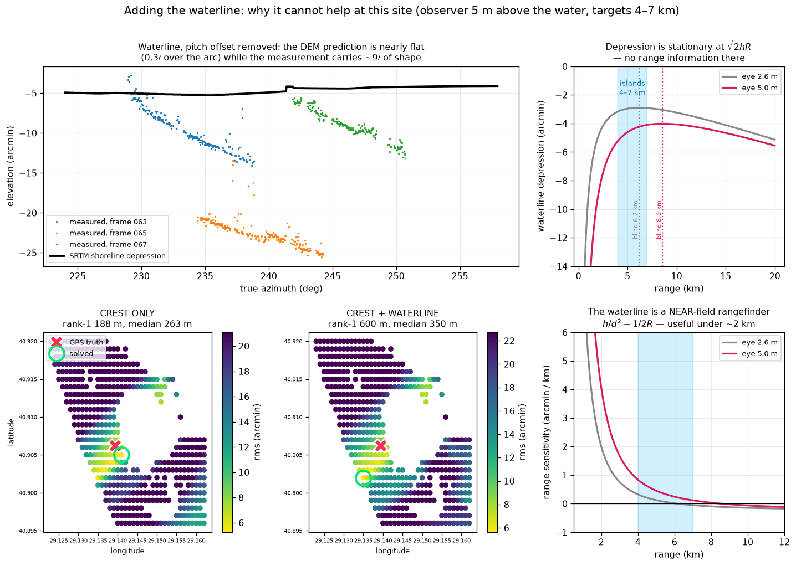

**Two process notes, both mine.**  The first run of this ablation was *invalid*:
`shore_depression` marched from 0.4 km, so the observer's own shore was the first
land hit, every azimuth returned NaN, and the waterline term was silently
dropped — I compared crest-only against crest-only.  That is trap 2 from the
section above, documented for the crest render and then not applied here.  And
the first version of the figure plotted the measured waterline without the
per-frame pitch offset, showing a 50′ "disagreement" that was almost entirely
uncorrected pitch; the solve removes it as a mean, so the solve was fair while
the picture was not.

**What the 5 m height did buy.**  Not the waterline, but the crest: fixing the
eye ABSOLUTELY rather than as ground + 2 m, and restricting candidates to
shore-adjacent ground, improved crest-only from **250 m to 188 m**.  The old
parameterisation let a candidate standing on 40 m of DEM ground claim a 42 m eye
and rescale every predicted elevation to suit.  Removing that freedom is worth
more than any observable added so far.
