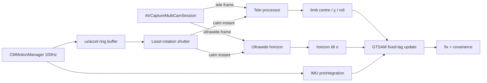

<!--- © 2026.  MIT License (see LICENSE file). -->

# Daytime Sun + Moon celestial fix — iPhone 17 Pro app architecture & engineering spec

This document maps the **validated `imu_fusion` simulation** onto a concrete native
iOS app for **iPhone 17 Pro**. Every module here already exists and is tested in
Python; the job of the app is to run the same math on live sensor data.

> **Honest scope.** This is a *buildable engineering spec*, not a shipped app. It was
> written in a Linux environment with no macOS/Xcode, so **none of the Swift below has
> been compiled or run**. Three things the simulation *assumes* can only be settled on
> the device and are flagged **[MEASURE ON DEVICE]** throughout:
> 1. whether `AVCaptureMultiCamSession` runs the **tele + ultrawide simultaneously** on
>    iPhone 17 Pro (Apple gates multi-cam by device/format);
> 2. the **real IMU noise** (Allan variance of the gyro/accel);
> 3. the **synthetic-horizon tilt floor** (~0.1° in the model) — the single number the
>    whole accuracy story rests on.
> A developer builds, signs, and tests this on a Mac + a physical iPhone 17 Pro.

What the simulation *did* establish (see [`RESULTS.md`](RESULTS.md)), and what the app
must reproduce: full-stack fix **~1.4–1.8 km** (land/sea/air), streaming solver
**~3.6 ms/update**, Sun heading **~0.1°** vs Moon bright-limb **~1.9°** (so the Sun
carries daytime heading), and the horizon-free **Δq(Sun−Moon)** differential line at
**σ ≈ 0.13°** that survives a sequential (one-phone) capture as long as the slew is
brisk (sea fix 5.0 → 5.9 km from a 0 → 30 s gap).

---

## 1. Simulation → app module map (the spine)

Each validated Python module has a direct iOS home. Port the *math* verbatim (it has
reference test vectors in `test/test_imu_fusion.py`); replace only the I/O.

| Sim module (validated) | Does | iOS home | Notes / risk |
|---|---|---|---|
| `disk_metrology.py` | sub-pixel NCC limb, **full-circle centre**, plate scale, illuminated fraction | Swift + **Metal** compute (per-ray erf-template NCC) or `vImage` | The full-circle centre (not the lit-blob centroid) is a correctness must — see §6. |
| `lunar_orientation.py` | rotational-NCC roll from craters/maria; `render_moon` reference | **Metal** kernel: rotate + masked NCC over angles, parabola-refine | 0.06° roll demonstrated; GPU makes the angle sweep real-time. |
| `optical_attitude.py` | bright-limb χ, illuminated fraction, parallactic `q`, `differential_orientation_sigma_deg`, sunspot/crater roll σ | pure Swift (trig) | No device dependency; unit-test against Python outputs. |
| `ultrawide_horizon.py` | optical horizon line + dip, tilt reference σ vs body altitude | `Vision` (line/edge) or a Metal RANSAC line fit on the ultrawide frame | Needs the ultrawide frame **concurrent** with the tele — see §3 **[MEASURE]**. |
| `capture_trigger.py` | least-rotation "smart shutter" (gate on \|ω\| minima) | `CoreMotion` ring buffer + trigger | Fire the shutter at gyro-rate troughs. |
| `celestial_factor_graph.py` | `CustomFactor` (alt/az/q/Δq), `ImuFactor`, priors, LM/covariance | **GTSAM built for iOS** (xcframework) + Obj-C++ bridge | Recommended over re-porting; the CustomFactor closures translate directly. |
| `realtime.py` | `IncrementalFixedLagSmoother`, one `update()`/shot, marginalisation | same GTSAM `gtsam_unstable` on iOS | ~3.6 ms/update in the sim → interactive on-device. |
| `astro.py` / `starfix` | Sun/Moon geographic position (GHA/Dec), alt/az | on-device ephemeris (port the almanac reader, or embed a compact VSOP/ELP) | Phone clock + `CoreLocation` seed time/position; the study validated the ephemeris to arc-seconds (`validate_ephemeris.py`). |
| `iphone_model.py` | sensor noise model | replaced by the **real** sensors; keep as the fallback/covariance prior until calibrated | Its `static_tilt_arcmin` is the **[MEASURE ON DEVICE]** floor. |

---

## 2. Frameworks & targets

- **Deployment:** iPhone 17 Pro, iOS 26+. Swift 6, SwiftUI.
- **Capture:** `AVFoundation` (`AVCaptureMultiCamSession`, `AVCaptureVideoDataOutput`).
- **Motion:** `CoreMotion` (`CMMotionManager.deviceMotion`, 100 Hz).
- **Location/time:** `CoreLocation` (position + PPS-disciplined time seed).
- **Vision/CV:** `Metal`/`MetalPerformanceShaders`, `Vision`, `Accelerate`/`vImage`.
- **Solver:** GTSAM (C++) compiled to an **`.xcframework`** with a thin Obj-C++ bridge
  (`GtsamBridge.mm`) exposing a Swift-friendly `FixedLagFuser` façade.
- **Persistence:** Swift `Codable` shot logs (for the calibration protocol, §6).

---

## 3. Capture pipeline



**Concurrency [MEASURE ON DEVICE].** The design wants the **tele** (resolves the disk:
sunspots/craters) and **ultrawide** (sees the horizon) *simultaneously*. Query
`AVCaptureMultiCamSession.isMultiCamSupported` and the actual supported
`AVCaptureDevice.Format` combinations on iPhone 17 Pro; if simultaneous tele+ultrawide
at usable resolution is not permitted, fall back to **sequential** tele→ultrawide with
the gyro tying them (the study's inter-shot-gap budget already models exactly this).

**Timestamp alignment.** Convert `CMSampleBuffer.presentationTimeStamp` and
`CMDeviceMotion.timestamp` to a common clock (both derive from `mach_absolute_time`);
preintegrate IMU **between** consecutive shot PTS. Sub-frame alignment matters because
the horizon tilt and the disk are read at the same instant.

**Sequential Sun→Moon (one phone).** Shoot the Sun (solar filter + exposure lock for
sunspots), slew ~94° to the Moon, shoot. The differential Δq factor advances the Moon
by the **known velocity × gap** (dead-reckon) and the gyro carries the vertical across
the slew — keep the gap to a few seconds (study: <2% fix penalty; degrades past
~10–20 s as the gyro-carry crosses the 0.13° floor).

**Solar filter.** A physical ND5 filter is mandatory for the Sun; exposure locked so
sunspots are mid-grey (the study showed an over-exposed disk loses the spots entirely).

---

## 4. Processing → solver data flow (per shot)

1. **Gate** on the |ω| trough (`capture_trigger`).
2. **Tele:** `subpixel_limb` → true centre + radius (Metal); centroid → alt/az pointing;
   `bright_limb_pa` / sunspot-crater **rotational NCC** → roll; illuminated fraction.
3. **Ultrawide:** fit the horizon line → tilt reference σ (fused with IMU gravity).
4. **IMU:** preintegrate accel+gyro since the last shot → an `ImuFactor`.
5. **Build factors:** per body — altitude, azimuth (Sun-led heading), parallactic `q`;
   plus the horizon-free **Δq(Sun−Moon)** differential; attach to the new keyframe pose.
6. **`FixedLagFuser.update()`** (GTSAM `IncrementalFixedLagSmoother`) → current pose,
   velocity, bias, and the **marginal covariance** (the fix ellipse).
7. Old keyframes outside the lag window marginalise out (bounded latency).

Each factor's σ comes straight from `optical_attitude` / `iphone_model` /
`ultrawide_horizon` — **until calibrated**, then swap in the measured numbers (§6).

---

## 5. UI (SwiftUI)

- **Fix view:** `MapKit` map with the current fix and its **covariance ellipse**;
  numeric lat/lon + 1σ.
- **Capture HUD:** live |ω| meter with the "calm now" cue (the smart shutter), horizon
  visibility indicator (in-frame vs IMU-only), solar-filter/exposure check.
- **Observable chips:** per-shot state — alt☉/alt☾/az/q/Δq present or dropped (cloud),
  each with its live σ; mirrors the ablation so the user sees *what is carrying the fix*.
- **Shot timeline:** the growing keyframe strip with marginalisation — the on-device
  twin of the published interactive [`graph_viewer.html`](graph_viewer.html).

---

## 6. On-device calibration protocol — the one number that matters

The model assumes a **~0.1° synthetic-horizon tilt floor** (`iphone_model.static_tilt_arcmin`).
Measure it before trusting any accuracy claim:

1. **Level reference.** Place the phone on a machinist's level / known-flat surface.
   Log `CMDeviceMotion.gravity` and `.attitude` for 5 min at 100 Hz.
2. **Static floor.** RMS of the attitude vs. the leveled truth → the static tilt σ
   (this is `static_tilt_arcmin`).
3. **Gyro Allan variance.** Log a stationary gyro run (30+ min); compute Allan deviation
   → angle-random-walk and bias-instability (feeds `gyro_noise_density`, `gyro_bias`).
4. **In-motion floor.** Repeat handheld / on a moving platform to get the tilt under the
   linear-acceleration corruption the model predicts (`a/g` term).
5. **Feed back.** Put the measured σ into `OpticalDiskSpec`/`IphoneImuSpec` equivalents;
   re-run the Python study to get the *device-true* accuracy envelope before shipping.

Ship a tiny **"Calibration"** screen that runs steps 1–4 and exports a `Codable` JSON —
so the loop from device → model → accuracy claim is closed with real numbers.

---

## 7. Xcode project layout & interop

```
CelestialFix.xcodeproj
├─ App/                 SwiftUI app, views, view-models
├─ Capture/             MultiCamCoordinator, MotionManager, SmartShutter
├─ Vision/              DiskMetrology.swift (+ .metal), HorizonFit, LunarRoll.metal
├─ Astro/               Ephemeris.swift (ported astro/starfix), Parallactic.swift
├─ Fusion/              FixedLagFuser.swift  ─┐
│                       GtsamBridge.mm/.h      ├─ Obj-C++ bridge to…
├─ ThirdParty/          gtsam.xcframework  ────┘  (CMake → xcframework)
└─ Tests/               XCTest: Swift math vs. Python reference vectors
```

- **GTSAM build:** CMake the C++ library for `arm64` device + simulator slices into an
  `.xcframework`; wrap `CustomFactor`, `ImuFactor`, `IncrementalFixedLagSmoother` behind
  `GtsamBridge` (Obj-C++), exposing a small Swift `FixedLagFuser`. [MEASURE] binary size
  & build flags (RTTI/exceptions).
- **`Info.plist`:** `NSCameraUsageDescription`, `NSMotionUsageDescription`,
  `NSLocationWhenInUseUsageDescription` with honest strings.
- **Tests:** XCTest asserts the Swift limb-fit / χ / q / Δq match the Python outputs this
  repo already generates (golden vectors) — the practical way to trust untested-by-me
  Swift.
- **Profiling:** Metal capture + Instruments for the NCC kernels; the solver is cheap
  (~ms), the CV is the Neural-Engine/GPU cost to watch.

---

## 8. Risk register & the MVP slice

| Risk | Impact | First action |
|---|---|---|
| Multi-cam tele+ultrawide concurrency | high | probe `isMultiCamSupported` + formats; else sequential path (already modelled) |
| GTSAM iOS build (size, flags) | medium | spike the xcframework early; fallback = port the fixed-lag LS in Accelerate |
| Ephemeris on device | medium | port the almanac reader; validated to arcsec in `validate_ephemeris.py` |
| Tilt-floor reality vs 0.1° model | high | run §6 calibration **first** |
| Thermal/exposure of the filtered Sun | medium | ND5 + exposure lock; field test |

**Smallest end-to-end MVP (build this first):** single **tele** capture of the Moon +
`CMDeviceMotion` → `subpixel_limb` centre + one altitude factor + IMU prior → one fix
with covariance in a minimal SwiftUI view. That proves the capture→feature→GTSAM→UI
spine on real hardware; every other observable (Sun, ultrawide horizon, Δq, streaming)
is then an additive factor on the same graph.

---

*Grounded in the validated `imu_fusion` study; numbers cited trace to `RESULTS.md`.
Items marked **[MEASURE ON DEVICE]** are genuine unknowns the simulation cannot settle.*
